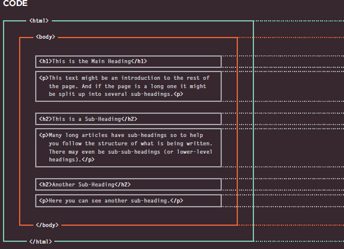
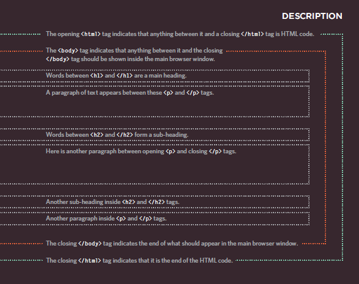

# Read: 01 - Introductory HTML and JavaScript

# Introduction
## **How the Web Works ?**

  When you visit a website, the web server hosting that site could be anywhere in the world. In order for you to find the location of the web server, your browser will first   connect to a Domain Name System (DNS) server.
  
  1. When you type a web address in a browser you connect to the internet service provider (ISP) 
  2. Your computer contacts the DNS(Domain Name Adress) servicess that provide your computer with the IP adress of the website that you visit
  3. Your computer conect to the web server that host the website using the IP adress that the DNS return
  4. The web server return the web page to your computer
  
  

# Structure

   The HTML code is made up of characters that live inside angled brackets — these are called HTML elements. Elements are usually made up of two tags: an opening tag and a closing tag. (The closing tag has an extra forward slash in it.) Each HTML element tells the browser something about the information that sits between its opening and closing tags.

    <html>
    <body>
    <h1>This is the Main Heading</h1>
    
This text might be an introduction to the rest of
    the page. And if the page is a long one it might
    be split up into several sub-headings.

    <h2>This is a Sub-Heading</h2>
    
Many long articles have sub-headings so to help
    you follow the structure of what is being written.
    There may even be sub-sub-headings (or lower-level
    headings).

    <h2>Another Sub-Heading</h2>
    
Here you can see another sub-heading.

    </body>
    </html>
    
   
      
 ## HTML Uses Elements to Describe the Structure of Pages 
  HTML has several different elements each element has an **Opening** and **Closing** tags
  
  
  
  
  
  
  
  
  
  
