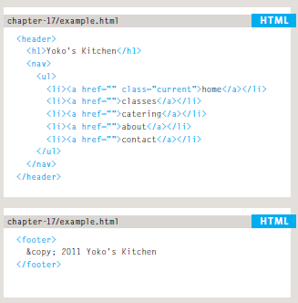

# Read: 01 - Introductory HTML and JavaScript

# Introduction

## **How the Web Works ?**

  When you visit a website, the web server hosting that site could be anywhere in the world. In order for you to find the location of the web server, your browser will first   connect to a Domain Name System (DNS) server.
  
  1. When you type a web address in a browser you connect to the internet service provider (ISP) 
  2. Your computer contacts the DNS(Domain Name Adress) servicess that provide your computer with the IP adress of the website that you visit
  3. Your computer conect to the web server that host the website using the IP adress that the DNS return
  4. The web server return the web page to your computer
  
  
  

# Structure

   The HTML code is made up of characters that live inside angled brackets — these are called HTML elements. Elements are usually made up of two tags: an opening tag and a closing tag. (The closing tag has an extra forward slash in it.) Each HTML element tells the browser something about the information that sits between its opening and closing tags. DOCTYPES tell browsers which version of HTML you are using.
   
   
    <html>
    <body>
    <h1>This is the Main Heading</h1>
    
This text might be an introduction to the rest of
    the page. And if the page is a long one it might
    be split up into several sub-headings.

    <h2>This is a Sub-Heading</h2>
    
Many long articles have sub-headings so to help
    you follow the structure of what is being written.
    There may even be sub-sub-headings (or lower-level
    headings).

    <h2>Another Sub-Heading</h2>
    
Here you can see another sub-heading.

    </body>
    </html>
    
        
   
   
      
      
 ## HTML Uses Elements to Describe the Structure of Pages 
 
 
  HTML has several different elements each element has an **Opening** and **Closing** tags
  
  
           
   
   
   
   
   
   
   Some HTML Element | Example 
   ----------------- | ----------------- 
   commint | (< !-- -- >)
   block | (< h1 >, < p >, < ul >, and < li >)
   inline | (< a >)
   inframe | (< inframe >)
   information | (< meta >)
  
  
  
  
 ##  Grouping Text & Elements In a Block
 
 
 ## **< div > element**
 
   The ( < div > ) element allows you to group a set of elements together in one block-level box.
   
   
    

    
    <ul>
    <li><a href="index.html">Home</a></li>
    <li><a href="biography.html">Biography</a></li>
    <li><a href="works.html">Works</a></li>
    <li><a href="contact.html">Contact</a></li>
    </ul>
    
<!-- end of header -->
     
     
     
  
 ## Attributes Tell Us More About Elements 
 
 
   Attributes provide additional information about the contents of an element. They appear on the opening tag of the element and are made up of two parts: a name and a value,  separated by an equals sign.
   
   
   
   
   
   
   Some HTML attribute | Example 
   ------------------- | ----------------- 
   id | (< p id="pullquote" >)
   class | (< p class="important" >)
   inframe | (< inframe >)
   information | (< meta >)
   

# HTML5 Layout

   HTML5 introduces a new set of elements that allow you to divide up the parts of a page. The names of these elements indicate the kind of content you will find in them. The point of creating these new elements is so that web page authors can use them to help describe the structure of the page. 
   
   
   
   
  ## Headers & Footers
   
   The < header > and < footer > elements can be used for:
     ● The main header or footer that appears at the top or bottom of every page on the site.
     ● A header or footer for an individual <article> or <section> within the page.
  
   
   
   
    
  ## Navigation
  
   The < nav > element is used to contain the major navigational blocks on the site such as the primary site navigation.
  
   
   
   
   
  ## Articles
  
   The < article > element acts as a container for any section of a page that could stand alone and potentially be syndicated. This could be an individual article or blog entry, a comment or forum post, or any other independent piece of content.
  
   
  
  
  
  ## Section 
  
   The < section > element groups related content together, and typically each section would have its own heading.
  
   
 
 
 
 
# A process that you can use when you are creating a new website.

  How to approach building a site
  
   1-Who is the Site For?
   2-Why People Visit YOUR Website
   3-What Your Visitors are Trying to Achieve
   4-How Of ten People Will Visit Your Site
   
  It's important to understand who your target audience is, why they would come to your site, what information they want to find and when they are likely to return.
  
  
  ## Site Maps
  
  Site maps allow you to plan the structure of a site.
  
  
  
  
  
  
  ## WireFrames
  
  A wireframe is a simple sketch of the key information that needs to go on each page of a site. It shows the hierarchy of the information and how much space it might require , it allow you to organize the information that will need to go on each page.
  
  
  
  
  
  
  
  
  
