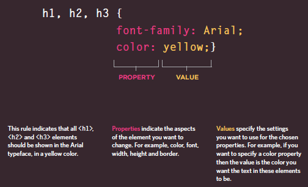

# **Text Introduction**

   HTML elements are used to describe **the structure** of the page using *headings, subheadings, paragraphs*, also it provides **semantic information** such: emphasis should be placed, the definition of any acronyms used, when given text is a quotation.
   
   
  ## How to add markup to the text 
   Thre istow type of markup :
   
   - **Structural markup**: the elements that you can use to describe both headings and paragraphs
   
   - **Semantic markup**: which provides extra information, such as where emphasis is placed in a sentence , that something you have written is a quotation, the meaning of   acronyms, and so on.
   
   
# **Structural markup**: 

  ## Headings 

   HTML has six "levels" of headings, the contents of an <h1> element is the largest, and the contents of an <h6> element is the smallest.
   
   
   head level    | tag
   ------------- | -------------  
   h1 | < h1 > This is a Main Heading < /h1 >
   h2 | < h2 > This is a Level 2 Heading < /h2 >
   h3 | < h3 > This is a Level 3 Heading < /h3 >
   h4 | < h4 > This is a Level 4 Heading < /h4 >
   h5 | < h5 > This is a Level 5 Heading < /h5 >
   h6 | < h6 > This is a Level 6 Heading < /h6 >
   
   
   
   
   
  
   
   
   
   
   
   
  ## Paragraph

   To create a paragraph, surround the words that make up the paragraph with an **opening < p>  tag and closing < /p > tag**.
   
   
   
   
   
  
   
   
   
   
   
   
  ## Bold & Italic

  **< b> ** : By enclosing words in the tags **< b > and < /b >** we can make characters appear bold.

  **< i >** :  By enclosing words in the tags **< i > and < /i >** we can make characters appear italic.
  
  
  
  
  
  
  
  
  
  
  
  
  
  ## Superscript & Subscript

   **< sup >** : The  element is used to contain characters that should be superscript such as the suffixes of dates or mathematical concepts like raising a number to a power such as 22.
   
   **< sub >** : The  element is used to contain characters that should be subscript. It is commonly used with foot notes or chemical formulas such as H20.
   
   
   
   
   
   
   
   
   
   
   
  ## Line Breaks & Horizontal Rules

   **< br >** :By Using < br > you add a line break inside the middle of a paragraph you can use the line break tag < br />.
   
   **< hr / >**  you can add a horizontal rule between sections using the < hr /> tag. There are a few elements that do not have any words between an opening and closing tag. They are **known as empty elements** and they are written differently.

    An empty element usually has only one tag. Before the closing angled bracket of an empty 
    element there will often be a space and a forward slash character. 
    
    
   
    

# **Semantic markup**:

  ## Strong & Emphasis
 
  **< strong >** : The use of the < strong > element indicates that its content has strong importance.
 
  **< em >** : The < em > element indicates emphasis that subtly changes the meaning of a sentence. By default browsers will show the contents of an < em > element in italic.
 
 
  
  
  
  
  
  ## Quotations
  
   There are two elements commonly used for marking up quotations:
   
   **< blockquote >** : The < blockquote > element is used for longer quotes that take up an entire paragraph. Note how the 
 element is still used inside the < blockquote > element.

   
   **< q >** :  The < q > element is used for shorter quotes that sit within a paragraph. 

  
   
   
   
   
  
# Introducing To CSS
  
  CSS allows you to create rules that specify how the content of an element should appear. For example, you can specify that the background of the page is cream, all paragraphs should appear in gray using the Arial typeface, or that all level one headings should be in a blue, italic, Times typeface.

  ### CSS Associates Style rules with HT ML elements
  
   CSS works by associating rules with HTML elements. These rules govern how the content of specified elements should be displayed. 
   A CSS rule contains two parts: a **selector and a declaration**.
   
   
   
   
   
   
   
   
  ### CSS Properties Affect How Elements Are Displayed
  
  CSS declarations sit inside curly brackets and each is made up of two parts: a property and a value, separated by a colon. You can specify several properties in one declaration, each separated by a semi-colon.
  
  
  
  
  
   #### Using External CSS
   
   **< link >** : The <link> element can be used in an HTML document to tell the browser where to find the CSS file used to style the page.It should use three attributes:
  
  - **href**
    This specifies the path to the CSS file.
   
  - **type** 
    This attribute specifies the type of document being linked to. The value should be text/css.

  - **rel**
    This specifies the relationship between the HTML page and the file it is linked to. The value should be stylesheet when linking to a CSS file.
   
   
   
   ### Using Internal CSS
   
   **< style >**
    You can also include CSS rules within an HTML page by placing them inside a <style> element, which usually sits inside the <head> element of the page. The <style> element    should use the type attribute to indicate that the styles are specified in CSS. The value should be text/css.
   
   [style](style.png)
   
   
   
   ### Selectors
   
   There are many different types of CSS selector that allow you to target rules to specific elements in an HTML document.CSS selectors are case sensitive, so they must match element names and attribute values exactly.
   
   
   [style](sel.png)
   
   
    
  
  
  
  
   
   

