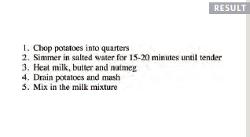
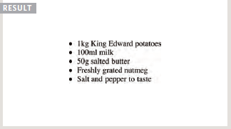

# Class-03

# List

  HTML provides us with three different types:
  
  ## Ordered lists :
 
   Are lists where each item in the list is numbered. For example,a legal contract where each point needs to be identified by a section number.
  
  
   **< ol >**
   
   The ordered list is created with the < ol > element.
  
  
   **< li >**
   
   Each item in the list is placed between an opening < li > tag and a closing < /li > tag. **(The li stands for list item.)**
      
   Example :
      
        <ol>
        <li>Chop potatoes into quarters</li>
         <li>Simmer in salted water for 15-20
        minutes until tender</li>
        <li>Heat milk, butter and nutmeg</li>
        <li>Drain potatoes and mash</li>
        <li>Mix in the milk mixture</li>
        </ol>
  
  
  
   
   
   
   
   
   
   
 ## Unordered lists :
 
   Are lists that begin with a bullet point (rather than characters that indicate order).
   
   
   **< ul >**
   
   The unordered list is created with the < ul > element.
  
  
  **< li >**
  
   Each item in the list is placed between an opening < li > tag and a closing < /li > tag. (The li stands for list item.)
     
     
  # Example :
  
  
         <ul>
         <li>1kg King Edward potatoes</li>
         <li>100ml milk</li>
         <li>50g salted butter</li>
         <li>Freshly grated nutmeg</li>
         <li>Salt and pepper to taste</li>
         </ul>
         
         
   
   
   
   
   
 
 ## Definition lists :
 
 
   Are made up of a set of terms along with the definitions for each of those terms.
   
   **< dl >**
   
   The definition list is created with the <  dl> element and usually consists of a series of terms and their definitions. Inside the < dl > element you will usually see pairs   of < dt > and < dd > elements.
   
   
   **< dt >**
   
   This is used to contain the term being defined (the definition term).
   
   
  **< dd >**
  
   This is used to contain the definition.
   
   
  # Example :

        <dl>
        <dt>Sashimi</dt>
        <dd>Sliced raw fish that is served with
        condiments such as shredded daikon radish or
        ginger root, wasabi and soy sauce</dd>
        <dt>Scale</dt>
        <dd>A device used to accurately measure the
        weight of ingredients</dd>
        <dd>A technique by which the scales are removed
        from the skin of a fish</dd>
        <dt>Scamorze</dt>
        <dt>Scamorzo</dt>
        <dd>An Italian cheese usually made from whole
        cow's milk (although it was traditionally made
        from buffalo milk)</dd>
        </dl>
   
   
   [defList](dlist.png
   
   
 ## Nested List 
  
   You can put a second list inside an < li > element to create a sublist or nested list.
        
        
   #  Example
   
   
            <ul>
          <li>Mousses</li>
           <li>Pastries
        <ul>
          <li>Croissant</li>
          <li>Mille-feuille</li>
          <li>Palmier</li>
          <li>Profiterole</li>
          </ul>
          </li>
          <li>Tarts</li>
        </ul>
        
        
        
   ![nested](nlist.png
        

   
   
   
 #
