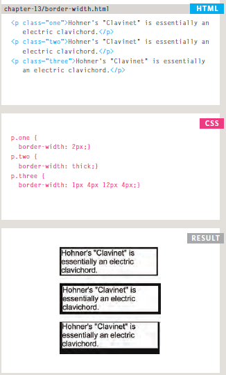

# Class-03

# List

  HTML provides us with three different types:
  
  
  ## Ordered List
 
   Are lists where each item in the list is numbered. For example,a legal contract where each point needs to be identified by a section number.
  
  
   **< ol >**
   
   The ordered list is created with the < ol > element.
  
  
   **< li >**
   
   Each item in the list is placed between an opening < li > tag and a closing < /li > tag. **(The li stands for list item.)**
  
  
  
  
  
  # Example :
      
        <ol>
        <li>Chop potatoes into quarters</li>
         <li>Simmer in salted water for 15-20
        minutes until tender</li>
        <li>Heat milk, butter and nutmeg</li>
        <li>Drain potatoes and mash</li>
        <li>Mix in the milk mixture</li>
        </ol>
  
  
  
   
   
   
   
   
   
   
 ## **Unordered List**
 
   Are lists that begin with a bullet point (rather than characters that indicate order).
   
   
   
   **< ul >**
   
   The unordered list is created with the < ul > element.
  
  
  **< li >**
  
   Each item in the list is placed between an opening < li > tag and a closing < /li > tag. (The li stands for list item.)
     
     
     
     
  # Example :
  
  
         <ul>
         <li>1kg King Edward potatoes</li>
         <li>100ml milk</li>
         <li>50g salted butter</li>
         <li>Freshly grated nutmeg</li>
         <li>Salt and pepper to taste</li>
         </ul>
         
         
   
   
   
   
   
   
   
 
 ##  **Definition lists**
 
 
   Are made up of a set of terms along with the definitions for each of those terms.
   
   
   
   **< dl >**
   
   The definition list is created with the <  dl> element and usually consists of a series of terms and their definitions. Inside the < dl > element you will usually see pairs   of < dt > and < dd > elements.
   
   
   
   
   **< dt >**
     
   
   This is used to contain the term being defined (the definition term).
   
   
   
  **< dd >**
  
   This is used to contain the definition.
   
   
   
   
   
  # Example :

        <dl>
        <dt>Sashimi</dt>
        <dd>Sliced raw fish that is served with
        condiments such as shredded daikon radish or
        ginger root, wasabi and soy sauce</dd>
        <dt>Scale</dt>
        <dd>A device used to accurately measure the
        weight of ingredients</dd>
        <dd>A technique by which the scales are removed
        from the skin of a fish</dd>
        <dt>Scamorze</dt>
        <dt>Scamorzo</dt>
        <dd>An Italian cheese usually made from whole
        cow's milk (although it was traditionally made
        from buffalo milk)</dd>
        </dl>
   
   
   
   
   
   
   
   
   
   
   
 ## **Nested List **
 
 
  
   You can put a second list inside an < li > element to create a sublist or nested list.
        
        
   #  Example
   
   
            <ul>
          <li>Mousses</li>
           <li>Pastries
        <ul>
          <li>Croissant</li>
          <li>Mille-feuille</li>
          <li>Palmier</li>
          <li>Profiterole</li>
          </ul>
          </li>
          <li>Tarts</li>
        </ul>
        
        
        
   
        

   
   
   
 # Boxes 
   
   
   You can set several properties that affect the appearance of these boxes. In this chapter you will see how to: 
   
   - Control the dimensions of your boxes
   - Create borders around boxes
   - Set margins and padding for boxes
   - Show and hide boxes
   
   
   ## Box Dimintions
   
   ### width, height
   
   
   To set your own dimensions for a box you can use the height and width properties.The most popular ways to specify the size of a box are to use pixels, percentages, or ems. Traditionally, pixels have been the most popular method because they allow designers to accurately control their size.
   
   
   # Example
     
           /** Html **/
     

        
The Moog company pioneered the commercial
            manufacture of modular voltage-controlled
            analog synthesizer systems in the early
             1950s.

    

    
    
          /**CSS**/
          
    div.box {
        height: 300px;
        width: 300px;
        background-color: #bbbbaa;}
    p {
        height: 75%;
        width: 75%;
        background-color: #0088dd;}
        
        
   
   
   
   
   ### Overflowing Content
   
   The overflow property tells the browser what to do if the content contained within a box is larger than the box itself. It can have one of two values:
   
   **hidden**
      
   This property simply hides any extra content that does not fit in the box.
   
   **scroll**
   
   This property adds a scrollbar to the box so that users can scrol
   
   
   The overflow property is particularly handy because some browsers allow users to adjust the size of the text to appear as large or as small as they want.
   If the text is set too large then the page can become an unreadable mess. Hiding the overflow on such boxes helps prevent items overlapping on the page.
   
   
   
   
   
   
   
   
   # Border, Margin & Padding
   
   Every box has three available properties that can be adjusted to control its appearance:
   
   1- Padding
   2- Margin 
   3- Border
   
   
   
   
   
   
   
   
   ## Border
   
   
   border      | tags        | note        | value
   ----------- | ----------- | ----------- | ----------- 
   border width | border-width | You cannot use percentages with this property | thin ,medium ,thick or pixcel
   border style | border-style | You can individually change the styles of different borders using: border-top-style border-left-style border-right-style border-bottom-style | solid , double , none,groove ,dashed
   border color | border-color | It is possible to individually control the colors of the borders using: border-top-color,border-right-color,border-bottom-color,border-left-color | You can specify the color of a border using either RGB values, hex codes or CSS color names
   
   
   
   # border- width
   
   
   
   # border-style
   
   
    
   # border-color
   
   
   
   
   
 ## Padding
 
 The padding property allows ou to specify how much space hould appear between the ontent of an element and its order.  You can specify different values for ach side of a box using:
 
 
   - padding-top
   - padding-right
   - padding-bottom
   - padding-left
   
   
   
   
   
 ## Margin
 
 The margin property controls the gap between boxes. Its value is commonly given in pixels,although you may also use percentages or ems.
 
   You can specify values for each side of a box using:
   
   - margin-top
   - margin-right
   - margin-bottom
   - margin-left
   
   
   
   
   
   
 ##
   
   

   
 
   

   
   
   
   
   
    
    
   
   

