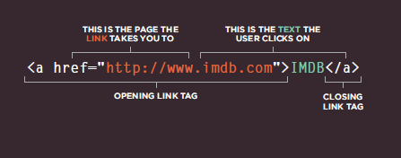

# Link

   Links are the defining feature of the web because they allow you to move from one web page to another.
   
   
   ## Writing Links
   
   Links are created using the < a > element. Users can click on anything between the opening < a > tag and the closing < /a > tag. You specify which page you want to link to using the href attribute.
   
   
   
   
   
  
  
  
  The text between the opening < a > tag and closing < /a > tag is known as link text. Where possible, your link text should explain where visitors will be taken .To write good link text, you can think of words people might use when searching for the page that you are linking to.
  
  
  

   ### Linking to Other Sites
   
   **< a >**  Links are created using the < a > element which has an attribute called href. The value of thehref attribute is the page that you want people to go to when they click on the link. Users can click on anything that appears between the opening < a > tag and the closing < /a > tag and will be taken to the page specified in the href attribute. When you link to a different website, the value of the href attribute will be the full web address for the site, which is known as an absolute URL.
   
   
   
            
Movie Reviews:
               <ul>
                     <li><a href="http://www.empireonline.com">
                              Empire</a></li>
                              
                     <li><a href="http://www.metacritic.com">
                              Metacritic</a></li>
                              
                     <li><a href="http://www.rottentomatoes.com">
                              Rotten Tomatoes</a></li>
                              
                     <li><a href="http://www.variety.com">
                              Variety</a></li>
                              
               </ul>
            

   
   
   
   
   
   
   
   
   ### Linking to Other Pages on the Sa me Site
   
   **< a >**  When you are linking to other pages within the same site, you do not need to specify the domain name in the URL. You can use a shorthand known as a relative URL. If all the pages of the site are in the same folder, then the value of the href attribute is just the name of the file. If you have different pages of a site in different folders, then you can use a slightly more complex syntax to indicate where the page is in relation to the current page.
   
   
   
            

                  <ul>
                     <li><a href="index.html">Home</a></li>
                     
                     <li><a href="about-us.html">About</a></li>
                     
                     <li><a href="movies.html">Movies</a></li>
                     
                     <li><a href="contact.html">Contact</a></li>
                     
                  </ul>
            

   
   
   
   
   
   
   
   
