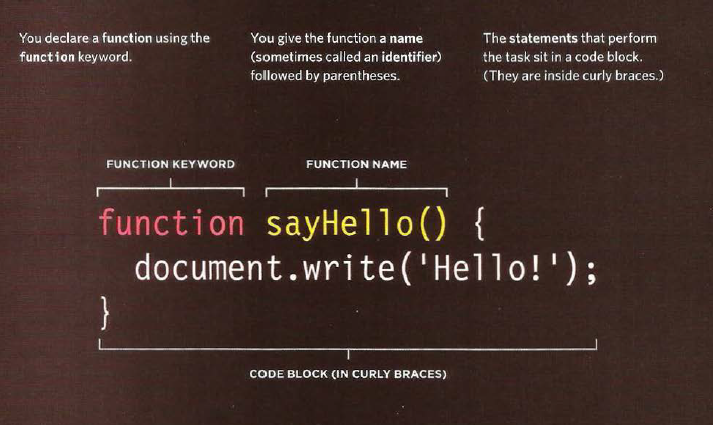
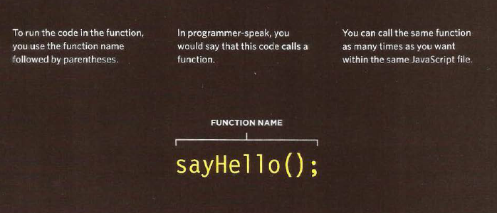
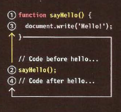
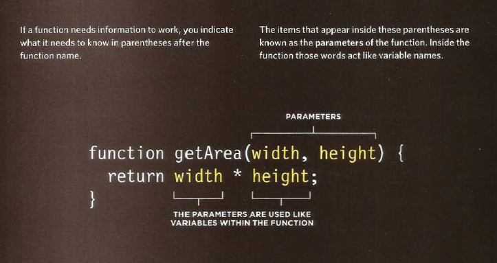
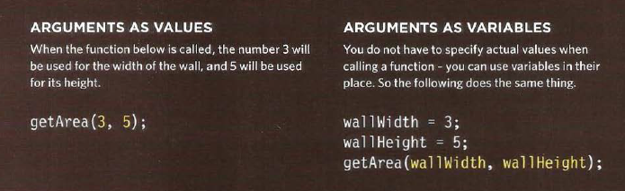

# Link

   Links are the defining feature of the web because they allow you to move from one web page to another.
   
   
   ## Writing Links
   
   Links are created using the < a > element. Users can click on anything between the opening < a > tag and the closing < /a > tag. You specify which page you want to link to using the href attribute.
   
   
   
   
   
  
  
  
  The text between the opening < a > tag and closing < /a > tag is known as link text. Where possible, your link text should explain where visitors will be taken .To write good link text, you can think of words people might use when searching for the page that you are linking to.
  
  
  

   ### Linking to Other Sites
   
   **< a >**  Links are created using the < a > element which has an attribute called href. The value of thehref attribute is the page that you want people to go to when they click on the link. Users can click on anything that appears between the opening < a > tag and the closing < /a > tag and will be taken to the page specified in the href attribute. When you link to a different website, the value of the href attribute will be the full web address for the site, which is known as an absolute URL.
   
   
   
            
Movie Reviews:
               <ul>
                     <li><a href="http://www.empireonline.com">
                              Empire</a></li>
                              
                     <li><a href="http://www.metacritic.com">
                              Metacritic</a></li>
                              
                     <li><a href="http://www.rottentomatoes.com">
                              Rotten Tomatoes</a></li>
                              
                     <li><a href="http://www.variety.com">
                              Variety</a></li>
                              
               </ul>
            

   
   
   
   
   
   
   
   
   ### Linking to Other Pages on the Sa me Site
   
   **< a >**  When you are linking to other pages within the same site, you do not need to specify the domain name in the URL. You can use a shorthand known as a relative URL. If all the pages of the site are in the same folder, then the value of the href attribute is just the name of the file. If you have different pages of a site in different folders, then you can use a slightly more complex syntax to indicate where the page is in relation to the current page.
   
   
   
            

                  <ul>
                     <li><a href="index.html">Home</a></li>
                     
                     <li><a href="about-us.html">About</a></li>
                     
                     <li><a href="movies.html">Movies</a></li>
                     
                     <li><a href="contact.html">Contact</a></li>
                     
                  </ul>
            

   
   
     
   
     
     
     
     
   ### Email Links
   
  ** mailto:**  To create a link that starts up the user's email program and addresses an email to a specified email address, you use the < a > element. However, this time the value of the href attribute starts with mailto: and is followed by the email address you want the email to be sent to.
  
  
  
  
  
  
  
  
 # Layout
 
 
   CSS treats each HTML element as if it is in its own box. This box will either be a **block-level box or an inline box**.
   **Block-level** boxes start on a new line and act as the main building blocks of any layout, while **inline boxes** flow between surrounding text. You can control how much space each box takes up by setting the width of the boxes .To separate boxes, you can use **borders, margins, padding, and background colors**.
   
   
   
   
   
   
   ### Containing Elements
   
   If one block-level element sits inside another block-level element then the outer box is known as the **containing or parent element**.
   
   
# Function , methood and object

  Programmers use functions, methods, and objects to organize their code.
  
   ### WHAT IS A FUNCTION?
   
   Group a series of statements together to perform a specific task. If different parts of a script repeat the same task, you can reuse the function (rather than repeating the same set of st atements).
   
             <!DOCTYPE html>
                  <html>
                        <head>
                              <ti t l e>Basic Function</title>
                                    <l i nk rel ="stylesheet" href="cs s/ c03.css" />
                        </head>
                              <body>
                                      <hl>TravelWorthy</ hl>
                                    
We lcome to our site! </ div>
                                       <script src="js/ basic-function .js"></ script>
                              </ body>
   
   
   
          var msg = 'Sign up to receive our newsletter for 10% off!';
                  function updateMessage() {
                      var el = document.getElementByld('message'};
                        el .textContent = msg;
                                    }
                     updateMessage(};
   
  
   
   
   
   
   
   ### How to declare a function ?
   
   
   
   
   
   
   
   
   ### How to call a function ?
   
   
   
    
    
    
   
   
   
   
   
   ### How to declare a function tht need information ?
   
   
   
   
   
   
   
   
   
   
   
   
   ### How to call a function that need information ?
    
    
    
   
    
    
    
    
# 6 Reasons for Pair Programming 

  pair programming is the practice of two developers sharing a single workstation to interactively tackle a coding task together. At Code Fellows, pair programing is one way we foster a collaborative environment while developing key industry skills.

   ### How does pair programming work?
   
   Pair programming commonly involves two roles: the Driver and the Navigator. The Driver is the programmer who is typing and the only one whose hands are on the keyboard.
   
   The Navigator uses their words to guide the Driver but does not provide any direct input to the computer. The Navigator thinks about the big picture, what comes next, how an algorithm might be converted in to code, while scanning for typos or bugs. The Navigator might also utilize their computer as a second screen to look up solutions and documentation, but should not be writing any code.
   
   
   ### Why pair program?
   
   1. Greater efficiency
   2. Engaged collaboration
   3. Learning from fellow students
   4. Social skills
   5. Job interview readiness
   6. Work environment readiness

    
   
    
    
  
  
  
   
   
   
   
   
