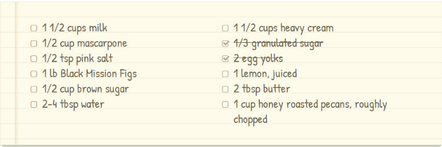
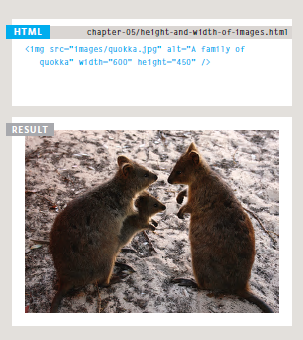
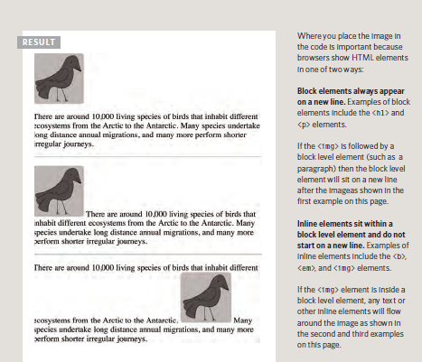
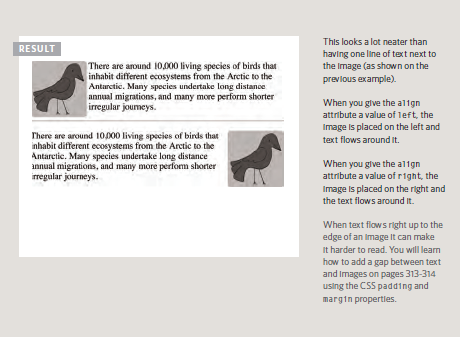
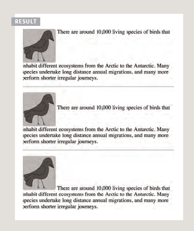

# Image

  ## How to add images to pages ?
  
   There are many reasons why you might want to add an image to a web page: you might want to include a logo, photograph, illustration, diagram, or chart.
   
   < img >  To add an image into the page you need to use an **< img > element**, which is an **empty element** (which means there is no closing tag).
   
  ### It must carry the following two attributes :
  
  
  
- **src**

This tells the browser where it can find the image file. This
will usually be a relative URL pointing to an image on your own site.

- **alt**

This provides a text description of the image which describes the image if you cannot see it.

**Title** : 

You can also use the title attribute with the < img > element to provide additional information about the image. 
Most browsers will display the content of this attribute in a tootip when the user hovers over the image.

You can also use CSS to include images in your pages using the **background-image** property.

 ## Choosing Images for Your Site
  
  Images can be used to set the tone for a site in less time than it takes to read a description. If you do not have photographs to use on your website, there are companies who sell stock images.
  
  These are images you pay to use :
  
  
  
  
  
  
   ### Height & Width of Images
   
   You will also often see an < img > element use two other attributes that specify **its size**:
   
   
  - **height**

   This specifies the height of the image in pixels.
  
  - **width**

   This specifies the width of the image in pixels. Images often take longer to load than the HTML code that makes up the rest of the page. It is, therefore, a good idea to specify the size of the image so that the browser can render the rest of the text on the page while leaving the right amount of space for the image that is still loading.
   
   
   
   
   
   
 ## Where to Place Images in Your Code
 
   Where an image is placed in the code will affect how it is displayed.
   Here are three examples of image placement that produce different results:

  - **before a paragraph** :
   
   The paragraph starts on a new line after the image.
   
  - **inside the start of a paragraph**
  
   The first row of text aligns with the bottom of the image.
   
  - **in the middle of a paragraph**
  
   The image is placed between the words of the paragraph that it appears in.
   
   
   
   
                
                                  
                    
There are around 10,000 living species of birds
                       that inhabit different ecosystems from the
                        Arctic to the Antarctic. Many species undertake
                       long distance annual migrations, and many more
                       perform shorter irregular journeys.
                    

                 

                 
                   
There are around 10,000 living
                        species of birds that inhabit different
                        ecosystems from the Arctic to the Antarctic. Many
                        species undertake long distance annual
                        migrations, and many more perform shorter
                        irregular journeys.

                

                
                  
There are around 10,000 living species of birds
                         that inhabit different ecosystems from the
                         Arctic to the Antarctic.Many species undertake long
                         distance annual migrations, and many more perform
                         shorter irregular journeys.

 
  
   
   
   
   
   
   
   
   ### Aligning Images Horizontally
   
   
   HTML The align attribute was commonly used to indicate how the other parts of a page should flow around an image. 
   
   The align attribute can take these horizontal values:
   
   - **left** : This aligns the image to the left (allowing text to flow around its right-hand side).
   
   
   - **right** : This aligns the image to the right (allowing text to flow around its left-hand side).
   
   
   
            
There are around
                                                10,000 living species of birds that inhabit
                                                different ecosystems from the Arctic to the
                                                Antarctic. Many species undertake long distance
                                                annual migrations, and many more perform shorter
                                                irregular journeys.

           
There are around
                                                10,000 living species of birds that inhabit
                                                different ecosystems from the Arctic to the
                                                Antarctic. Many species undertake long distance
                                                annual migrations, and many more perform shorter
                                                irregular journeys.

   
   
   
   
   
       
   
   
   
   
   
   ### Aligning Images Vertically
   
   There are three values that the align attribute can take that control how the image should align vertically with the text that surrounds it:
   
   
   - **top**
  
     This aligns the first line of the surrounding text with the top of the image.
   
   -**middle**
   
   This aligns the first line of the surrounding text with the middle of the image.

   -**bottom**
   
   This aligns the first line of the surrounding text with the bottom of the image.
   
   
                 
There are around
                                                          10,000 living species of birds that inhabit
                                                          different ecosystems from the Arctic to the
                                                          Antarctic. Many species undertake long distance
                                                          annual migrations, and many more perform shorter
                                                          irregular journeys.

                
There are around
                                                            10,000 living species of birds that inhabit
                                                            different ecosystems from the Arctic to the
                                                            Antarctic. Many species undertake long distance
                                                            annual migrations, and many more perform shorter
                                                            irregular journeys.

               
There are around
                                                         10,000 living species of birds that inhabit
                                                         different ecosystems from the Arctic to the
                                                         Antarctic. Many species undertake long distance
                                                         annual migrations, and many more perform shorter
                                                         irregular journeys.

   
   
   
   
   
   
   
   
   
   
   
   
   
   
   
 
 
 
 
 
 
 
 
