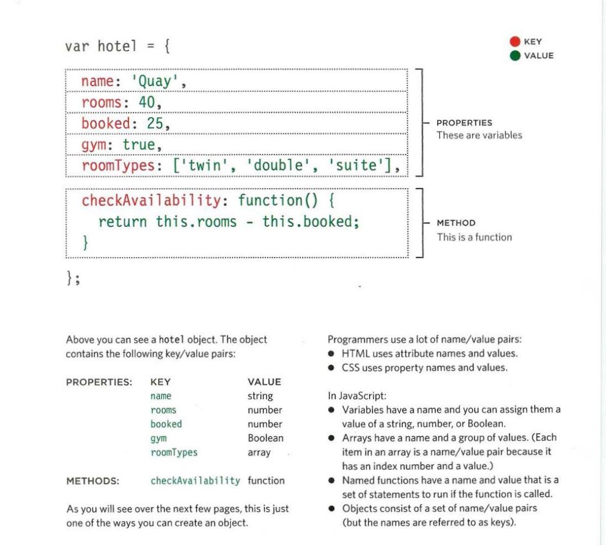
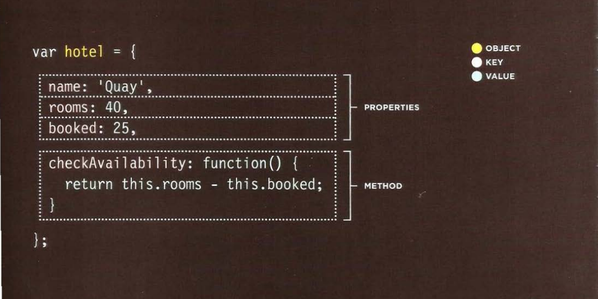
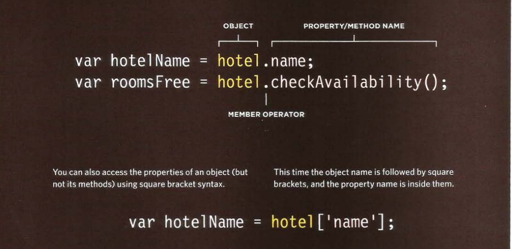

# OBJECT

##  What is an Object?

Objects group together a set of variables and functions to create a model 
of a something you would recognize from the real world. In an object, 
variables and functions take on new names.

### Property

IN AN OBJECT: VARIABLES BECOME KNOWN AS PROPERTIES 
If a variable is part of an object, it is called a 
property. Properties tell us about the object, such as 
the name of a hotel or the number of rooms it has. 
Each individual hotel might have a different name 
and a different number of rooms. 

### Method

IN AN OBJECT: FUNCTIONS BECOME KNOWN AS METHODS 
If a function is part of an object, it is called a method. 
Methods represent tasks that are associated with 
the object. For example, you can check how many 
rooms are available by subtracting the number of 
booked rooms from the total number of rooms.

 
   

### Creating an object literal notation

Literal is a way for creating an object.

   

### Accessing an object 

Using **dot notation** we can access the object properties and methods.

   

# Document object model

The Document Object Model (DOM) specifies how browsers should create a model of an HTML page and how JavaScript can access and update the 
contents of a web page while it is in the browser window. 

The DOM is neither part of HTML, nor part of JavaScript; it is a separate set of rules. It is implemented by all major browser makers,
 and covers two primary areas: 

1- MAKING A MODEL OF THE HTM L PAGE
2- ACCESSING AND CHANGING THE HTML PAGE

## Dom tree 

As a browser loads a web page, it creates a model of that page. The model is called a DOM tree, and it is stored in the browsers' memory. 
It consists of four main types of nodes. 

1-THE DOCUMENT NODE 
2-ELEMENT NODES
3-ATTRIBUTE NODES
4-TEXT NODES

   

