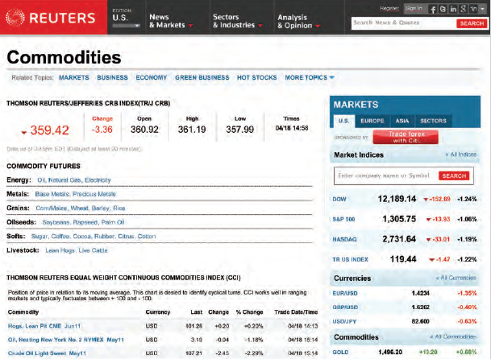
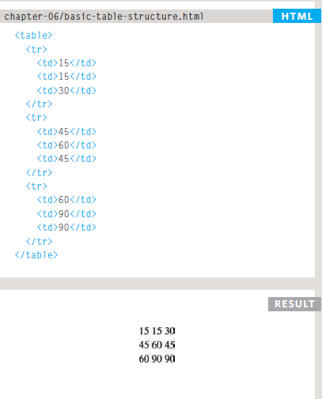
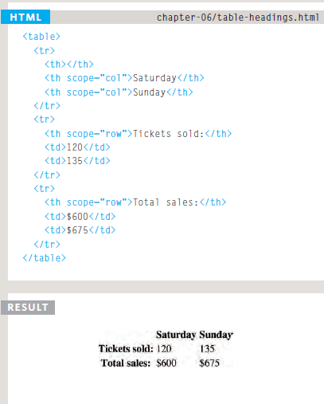

# Tables 

There are several types of information that need to be displayed in a grid or table. For example: sports results, stock reports, train timetables. When representing information in a table, you need to think in terms of a grid made up of rows and columns (a bit like a spreadsheet).

## What's a Table?

A table represents information in a grid format.Examples of tables include financial reports, TV schedules, and sports results.

## Basic Table Structure 

- **< table >**

The < table > element is used to create a table. The contents of the table are written out row by row.

- **< tr >**

You indicate the start of each row using the opening **< tr > tag**. (*The tr stands for table row.*) .
It is followed by one or more **< td > elements** (*one for each cell in that row*). At the end of the row you use a closing < /tr > tag.

- **< td >**

Each cell of a table is represented using a < td > element. (The td stands for table data.)

### Table Headings

- **< th >**
The < th > element is used just like the < td > element but its purpose is to represent the heading for either a column or a row. (The th stands for table heading.)
Even if a cell has no content, you should still use a < td > or < th > element to represent the presence of an empty cell otherwise the table will not render correctly. 

## Example

              <html>
                 <head>
                   <title>Tables</title>
                 </head>
                 
                 <body>
                      <table>
                          <thead>
                              <tr>
                                  <th></th>
                                      <th scope="col">Home starter hosting</th>
                                      <th scope="col">Premium business hosting</th>
                              </tr>
                          </thead>
                      <tbody>
                              <tr>
                                  <th scope="row">Disk space</th>
                                     <td>250mb</td>
                                     <td>1gb</td>
                              </tr>
                              <tr>
                                  <th scope="row">Bandwidth</th>
                                  <td>5gb per month</td>
                                  <td>50gb per month</td>
                              </tr>
                            <!-- more rows like the two above here -->
                      </tbody>
                      <tfoot>
                              <tr>
                                  <td></td>
                                  <td colspan="2">Sign up now and save 10%!</td>
                              </tr>
                      </tfoot>
                      </table>
                  </body>
               </html>

