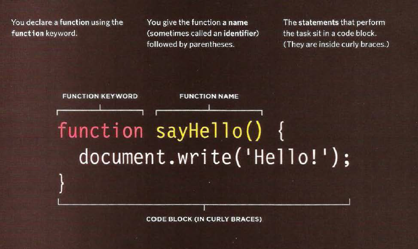
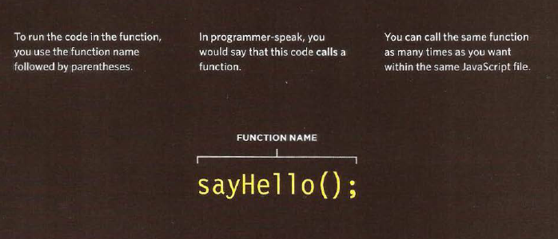
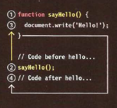
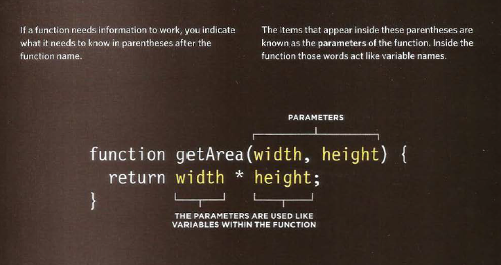
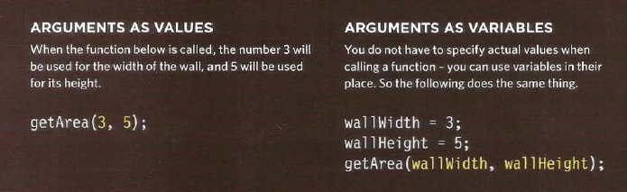

 
  
 # Layout
 
 
   CSS treats each HTML element as if it is in its own box. This box will either be a **block-level box or an inline box**.
   **Block-level** boxes start on a new line and act as the main building blocks of any layout, while **inline boxes** flow between surrounding text. You can control how much space each box takes up by setting the width of the boxes .To separate boxes, you can use **borders, margins, padding, and background colors**.
   
   
   
   
   
   
   ### Containing Elements
   
   If one block-level element sits inside another block-level element then the outer box is known as the **containing or parent element**.
   
   
# Function , methood and object

  Programmers use functions, methods, and objects to organize their code.
  
   ### WHAT IS A FUNCTION?
   
   Group a series of statements together to perform a specific task. If different parts of a script repeat the same task, you can reuse the function (rather than repeating the same set of st atements).
   
             <!DOCTYPE html>
                  <html>
                        <head>
                              <ti t l e>Basic Function</title>
                                    <l i nk rel ="stylesheet" href="cs s/ c03.css" />
                        </head>
                              <body>
                                      <hl>TravelWorthy</ hl>
                                    
We lcome to our site! </ div>
                                       <script src="js/ basic-function .js"></ script>
                              </ body>
   
   
   
          var msg = 'Sign up to receive our newsletter for 10% off!';
                  function updateMessage() {
                      var el = document.getElementByld('message'};
                        el .textContent = msg;
                                    }
                     updateMessage(};
   
  
   
   
   
   
   
   ### How to declare a function ?
   
   
   
   
   
   
   
   
   ### How to call a function ?
   
   
   
    
    
    
   
   
   
   
   
   ### How to declare a function tht need information ?
   
   
   
   
   
   
   
   
   
   
   
   
   ### How to call a function that need information ?
    
    
    
   
    
    
    
    
