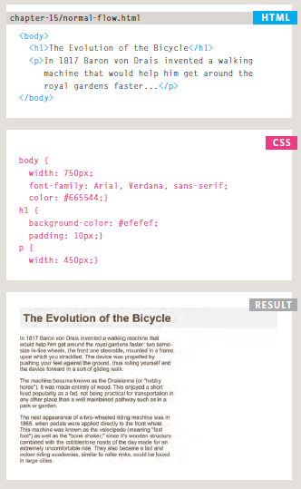

 
  
 # Layout
 
 
   CSS treats each HTML element as if it is in its own box. This box will either be a **block-level box or an inline box**.
   **Block-level** boxes start on a new line and act as the main building blocks of any layout, while **inline boxes** flow between surrounding text. You can control how much space each box takes up by setting the width of the boxes .To separate boxes, you can use **borders, margins, padding, and background colors**.
   
   
   
   
   
   
   ### Containing Elements
   
   If one block-level element sits inside another block-level element then the outer box is known as the **containing or parent element**.
   
   It is common to group a number of elements together inside a < div > (or other block-level) element. For example, you might group together all of the elements that form the header of a site (such as the logo and the main navigation). The < div > element that contains this group of elements is then referred to as the containing element.
   
   
   
   
   
   
   
   ### Controll ing the Position of Elements
   
   
   CSS has the following positioning schemes that allow you to control the layout of a page: normal flow, relative positioning, and absolute positioning. You specify the positioning scheme using the position property in CSS. You can also float elements using the float property.
   
   
   
   
   
   To indicate where a box should be positioned, you may also need to use box **offset properties** to tell the browser how far from the top or bottom and left or right it should be placed. 
   
   
   
   
   
## Normal flow (position:static )

 normal flow, each block-level element sits on top of the next one. Since this is the default way in which browsers treat HTML elements, you do not need a CSS property to indicate that elements should appear in normal flow, but the syntax would be:
 
  **position: static;**
  
  
  
  
 
## Relative position (position:relative)

 Relative positioning moves an element in relation to where it would have been in normal flow. For example, you can move it 10 pixels lower than it would have been in normal flow or 20% to the right.
You can indicate that an element should be relatively positioned using the position property with a value of relative.
You then use the offset properties (top or bottom and left or right) to indicate how far to move the element from where it would have been in normal flow.

## Absolute position (position:absolute)

 When the position property is given a value of absolute, the box is taken out of normal flow and no longer affects the position of other elements on the page. (They act like it is not there.) The box offset properties (top or bottom and left or right) specify where the element should appear in relation to its containing element.
 
 
   
   
## Fixed position (position:fixed)   

  Fixed positioning is a type of absolute positioning that requires the position property to have a value of fixed. It positions the element in relation to the browser window. Therefore, when a user scrolls down the page, it stays in the exact same place.
To control where the fixed position box appears in relation to the browser window, the box offset properties are used.

## A Fixed Width Layout

To create a fixed width layout, the width of the main boxes on a page will usually be specified in pixels (and sometimes their height, too).
 
 
 
      <body>
       

        <h1>Logo</h1>
      

       <ul>
          <li><a href="">Home</a></li>
          <li><a href="">Products</a></li>
          <li><a href="">Services</a></li>
          <li><a href="">About</a></li>
          <li><a href="">Contact</a></li>
       </ul>
         

    

       

         

           
Feature

        

         

           
Column One

        

         

           
Column Two

         

         

           
Column Three

          

          

         

         
&copy; Copyright 2011

         

          </body>

## Liquid Layout
The liquid layout uses
percentages to specify the width of each box so that the design will stretch to fit the size of the screen.
 When trying this in your browser, remember to make the window smaller and larger.
 
 
 
 
 
 
 
 
 
 
 
 

   
   

 
    
    
    
