# Form 

## Traditionally, the term 'form' has referred to a printed document that contains spaces for you to fill in information.

Whether you are adding a simple search box to your website or you need to create more complicated insurance applications, HTML forms give you a set of elements to collect data from your users.

### Why form ?

The best known form on the web is probably the search box that sits right in the middle of Google's homepage.In addition to enabling users to search, forms also allow users to perform other functions online. You will see forms when registering as a member of a website, when shopping online, and when signing up for newsletters or mailing lists.

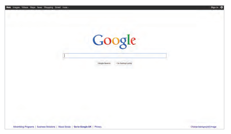

### Forms controls 

There are several types of form controls that you can use to collect information from visitors to your site.

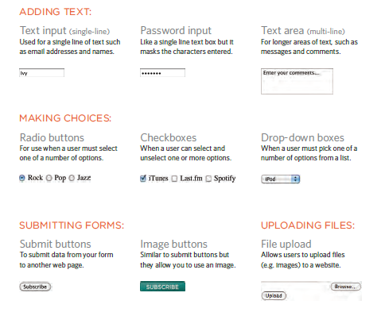

### How Forms Work ?

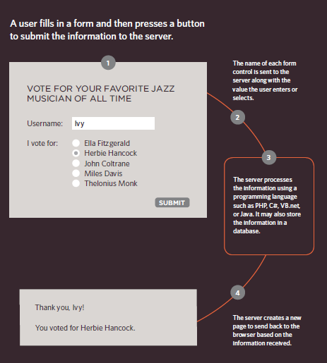

A form may have several form controls, each gathering different information. The server needs to know which piece of inputted data corresponds with which form element.

## Form Structure

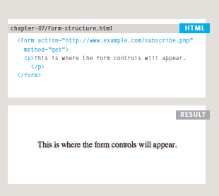

### Text Input

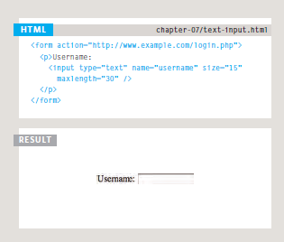

### Password Input

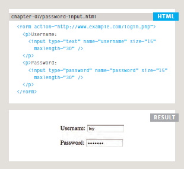

### Text Area

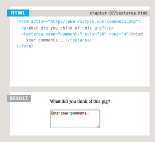

### Radio Button

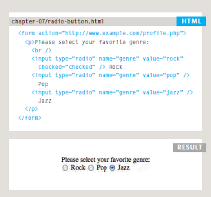

### Checkbox Button

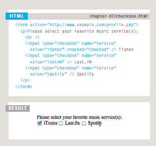

### DropDown List Box

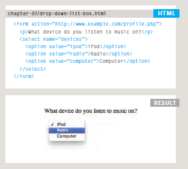

### Multiple Select Box

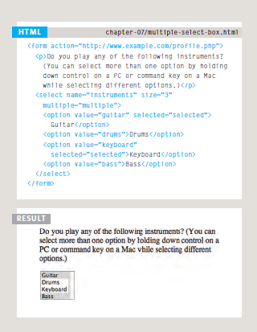

# List, Table & Form 

Nobody I know enjoys filling in forms, so if you can make yours look more attractive and easier to use, more people are likely to fill it in. Also, when you come to look at a form in a few different browsers, you will see that
each browser displays them differently.
CSS is commonly used to control the appearance of form elements. This is both to make them more attractive and to make them more consistent across different browsers It is most common to style:

- Text inputs and text areas
- Submit buttons
- Labels on forms, to get the form controls to align nicely

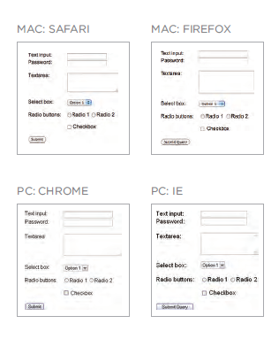

### Styling Text Inputs

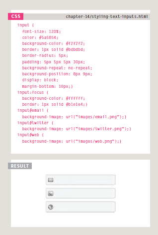

### Styling Submit Button

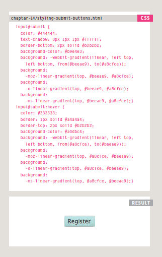

## Example 

        background-color: #00CC33;
                color: #FFFFFF;
                cursor: pointer;}
        .title {
                    float: left;
                      width: 160px;
                    clear: left;}
       .submit {
                    width: 310px;
                    text-align: right;}
                    
                    
                    
                </style>
                  </head>
                  <body>
                        <h1>Poetry Workshops</h1>
                        
We will be conducting a number of poetry workshops
                              and symposiums throughout the year.

                        
Please note that the following events are free to
                             members:

                        <ul>
                            <li>A Poetic Perspective</li>
                            <li>Walt Whitman at War</li>
                            <li>Found Poems and Outsider Poetry</li>
                        </ul>
                        <table>
                            <tr class="head">
                            <th></th>
                            <th>New York</th>
                            <th>Chicago</th>
                            <th>San Francisco</th>
                            </tr>
                            <tr>
                            <th>A Poetic Perspective</th>
                            <td>Sat, 4 Feb 2012 11am - 2pm</td>
                            <td>Sat, 3 Mar 2012 11am - 2pm</td>
                            <td>Sat, 17 Mar 2012 11am - 2pm</td>
                            </tr>
                            <tr class="even">
                            <th>Walt Whitman at War</th>
                            
                            <td>Sat, 7 Apr 2012 11am - 1pm</td>
                            <td>Sat, 5 May 2012 11am - 1pm</td>
                            <td>Sat, 19 May 2012 11am - 1pm</td>
                            </tr>
                            <tr>
                            <th>Found Poems &amp; Outsider Poetry</th>
                            <td>Sat, 9 Jun 2012 11am - 2pm</td>
                            <td>Sat, 7 Jul 2012 11am - 2pm</td>
                            <td>Sat, 21 Jul 2012 11am - 2pm</td>
                            </tr>
                            <tr class="even">
                            <th>Natural Death: An Exploration</th>
                            <td>Sat, 4 Aug 2012 11am - 4pm</td>
                            <td>Sat, 8 Sep 2012 11am - 4pm</td>
                            <td>Sat, 15 Sep 2012 11am - 4pm</td>
                            </tr>
                    </table>
                 <form action="http://www.example.com/form.php" method="get">
                        <fieldset>
                                <legend>Register your interest</legend>
                                
<label class="title" for="name">Your name:</label>
                                <input type="text" name="name" id="name"> 
                                <label class="title" for="email">Your email:</label>
                                <input type="text" name="email" id="email">

                                
<label for="location" class="title">Your closest center:</label>
                                <select name="location" id="location">
                                <option value="ny">New York</option>
                                <option value="il">Chicago</option>
                                <option value="ca">San Francisco</option>
                                </select>

                                Are you a member?
                                <label><input type="radio" name="member" value="yes" /> Yes</label>
                                <label><input type="radio" name="member" value="no" /> No</label>

                    </fieldset>
              
<input type="submit" value="Register" />

              </form>
          </body>
          </html>
          
          
 
          

