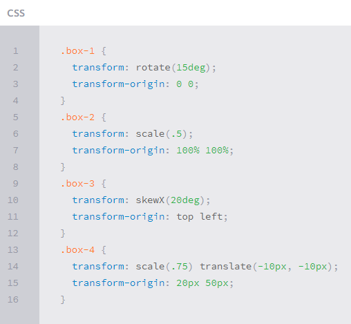
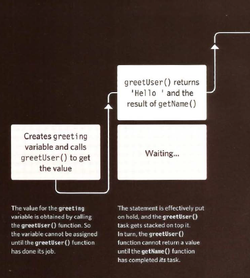
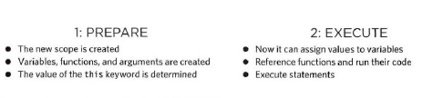
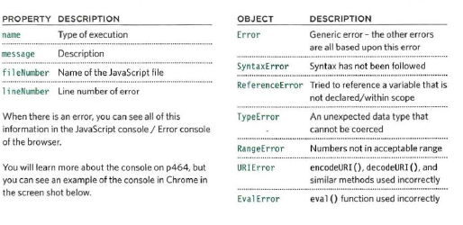
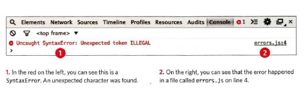

# Error Handling & Debugging

 JavaScript can be hard to learn and everyone makes mistakes when writing it.Error Handling & Debugging will help you learn
how to find the errors in your code. It will also teach you how to write scripts that deal with potential errors gracefully.

When you are writing JavaScript, do not expect to write it perfectly the first time. Programming is like problem solving: you are given a puzzle and not only do you have to solve it, but you also need to create the instructions that allow the computer to solve it. too.

When writing a long script, nobody gets everything right in their first attempt. The error messages that a browser gives look cryptic at first, but they can help you determine what went wrong in your JavaScript and how to fix it.

## ORDER OF EXECUTION

To find the source of an error, it helps to know how scripts are processed. The order in which statements are executed can be complex; some tasks cannot complete until another statement or function has been run.

1. The greeting variable gets its value from the **greetUser()** function.
2. **greetUser()** creates the message by combining the string 'He 11 o ' with the result of getName ().
3. **getName ()** returns the name to greetUser() .
2. **greetUser()** now knows the name, and combines it with the string. It then returns the message to the statement that ca lled it in step 1.
1. The value of the greeting is stored in memory.
4. This greeting variable is written to an alert box.

## The Stack

The JavaScript interpreter processes one line of code at a time. when a statement needs data from another function it stacks the new function on top of the current task.

## EXECUTION CONTEXT & HOISTING

Each time a script enters a new execution context, there are two phases of activity:

## ERROR OBJECTS

Error objects can help you find where your mistakes are and browsers have tools to help you read them.

When an Er ror object is created, it will contain the following properties and there are seven types of built-in error objects in
JavaScript.

