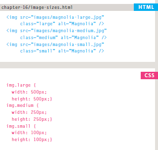
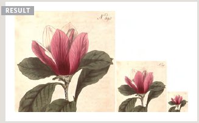
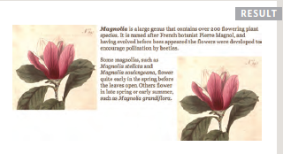
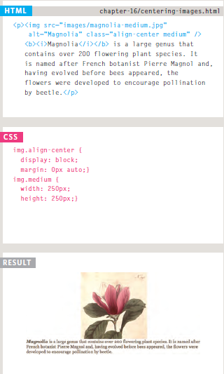

# Image

## Controlling size of images in CSS
You can control the size of an image using the width and height properties in CSS,Specifying image sizes helps pages to load more smoothly because the HTML and CSS code will often load before the images, and telling the browser how much space to leave for an image allows it to render the rest of the page without waiting for the image to download.

First you need to determine the sizes of images that will be used commonly throughout the site, then give each size a name.
            
            For example:
                      small
                      medium
                      large

Where the < img > elements appear in the HTML, rather than using width and height attributes you can use these names as values for the class attribute. In the CSS, you add selectors for each of the class names, then use the CSS width and height properties to control the image dimensions.

## Aligning images in CSS

Rather than using the < img > element's align attribute, web page authors are increasingly using the float property to align images.
There are two ways that this is commonly achieved:

1. The float property is added to the class that was created to represent the size of the image.

2. New classes are created with names such as align-left or align-right to align the images to the left or right of the page. These class names are used in addition to classes that indicate the size of the image.

# Html Ex:

        

                        <b><i>Magnolia</i></b> is a large genus that
                                              contains over 200 flowering plant species...

        

                                              Some magnolias, such as <i>Magnolia stellata</i>
                                              and <i>Magnolia soulangeana</i>, flower quite
                                              early in the spring before the leaves open...

# CSS EX:

         img.align-left {
                      float: left;
                      margin-right: 10px;}
                      
         img.align-right {
                      float: right;
                      margin-left: 10px;}
                      img.medium {
                      width: 250px;
                      height: 250px;}
                      
                      
       

  ### Centering images Using CSS
  
  By default, images are inline elements. This means that they flow within the surrounding text.
In order to center an image, it should be turned into a blocklevel element using the display property with a value of block.
Once it has been made into a block-level element, there are two common ways in which you can horizontally center an image:

1. On the containing element, you can use the text-align property with a value of center.

2. On the image itself, you can use the use the margin property and set the values of the left and right margins to auto.

  

## Adding background images

                  
   
