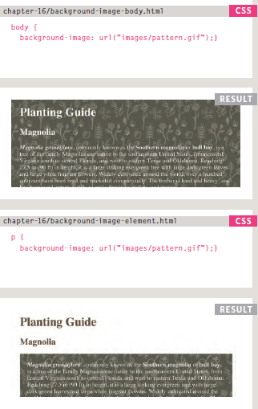
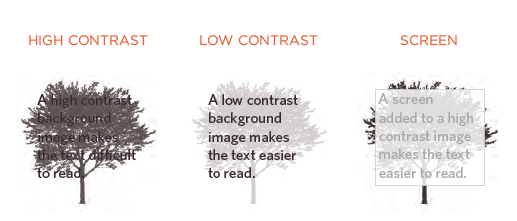
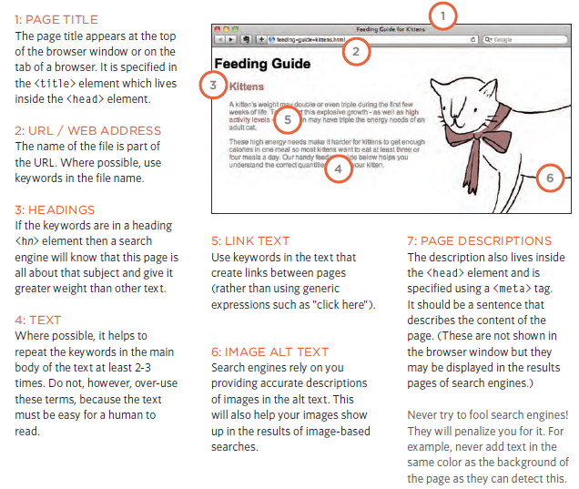
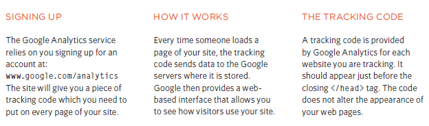
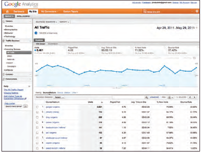

# Image

## Controlling size of images in CSS
You can control the size of an image using the width and height properties in CSS,Specifying image sizes helps pages to load more smoothly because the HTML and CSS code will often load before the images, and telling the browser how much space to leave for an image allows it to render the rest of the page without waiting for the image to download.

First you need to determine the sizes of images that will be used commonly throughout the site, then give each size a name.
            
            For example:
                      small
                      medium
                      large

Where the < img > elements appear in the HTML, rather than using width and height attributes you can use these names as values for the class attribute. In the CSS, you add selectors for each of the class names, then use the CSS width and height properties to control the image dimensions.

## Aligning images in CSS

Rather than using the < img > element's align attribute, web page authors are increasingly using the float property to align images.
There are two ways that this is commonly achieved:

1. The float property is added to the class that was created to represent the size of the image.

2. New classes are created with names such as align-left or align-right to align the images to the left or right of the page. These class names are used in addition to classes that indicate the size of the image.

  ### Html Ex:

        

                        <b><i>Magnolia</i></b> is a large genus that
                                              contains over 200 flowering plant species...

        

                                              Some magnolias, such as <i>Magnolia stellata</i>
                                              and <i>Magnolia soulangeana</i>, flower quite
                                              early in the spring before the leaves open...

  ### CSS EX:

         img.align-left {
                      float: left;
                      margin-right: 10px;}
                      
         img.align-right {
                      float: right;
                      margin-left: 10px;}
                      img.medium {
                      width: 250px;
                      height: 250px;}
                      
                      
       

  ### Centering images Using CSS
  
  By default, images are inline elements. This means that they flow within the surrounding text.
In order to center an image, it should be turned into a blocklevel element using the display property with a value of block.
Once it has been made into a block-level element, there are two common ways in which you can horizontally center an image:

1. On the containing element, you can use the text-align property with a value of center.

2. On the image itself, you can use the use the margin property and set the values of the left and right margins to auto.

  

## Adding background images
The background-image property allows you to place an image behind any HTML element. This could be the entire page or just part of the page. By default, a background image will repeat to fill the entire box.
The path to the image follows the letters url, and it is put inside parentheses and quotes

  ### Contrast of background images
  
  If you want to overlay text on a background image, the image must be low contrast in order for the text to be legible.
  
  

                    

# Particular Information

## Search engine optimization
Search engine optimization (or SEO) is the practice of trying to help your site appear nearer the top of search engine results when people look for the topics that your website covers.
At the heart of SEO is the idea of working out which terms people are likely to enter into a search engine to find your site and then using these terms in the right places on your site to increase the chances that search engines will show a link to your site in their results.
In order to determine who comes first in the search results, search engines do not only look at what appears on your site. They also
consider how many sites link to you (and how relevant those links are).
For this reason, SEO is often split into two areas:

1. on-page techniques 

   On-page techniques are the methods you can use on your web pages to improve their rating in search engines. The main component of this is
   looking at keywords that people are likely to enter into a search engine if they wanted to find your site, and then including these in the text and HTML code for your site in    order to help the search engines know that your site covers these topics.

2. off-page techniques.
 
   Getting other sites to link to you is just as important as on-page techniques. Search engines help determine how to rank your site by looking at the number of other sites        that link to yours. Search engines also look at the
   words between the opening < a > tag and closing < /a > tag in the link. If the text in the link contains keywords (rather than just click here or your website address) it may    be considered more relevant. The words that appear in links to your site should also appear in the text of the page that the site links to.

  ## How to Identify Keywords and Phrases
  
  Here are six steps that will help you identify the right keywords and phrases for your site.
  
  1. Brainstorm
     List down the words that someone might type into Google to find your site. Be sure to include the various topics, products or services your site is about.
     
  2. Organize
     Group the keywords into separate lists for the different sections or categories of your website.
     
  3. Research
     There are several tools that let you enter your keywords and then they will suggest additional keywords you might like to consider, such as:
     **adwords.google.co.uk/ select/KeywordToolExternal**
     (When using this tool, select the "exact match" option rather than "broad match.")
      - **[REsearch Tool](www.wordtracker.com)**
      - **[REsearch Too](www.keyworddiscovery.com)**

  4. Compare
     It is very unlikely that your site will appear at the top of the search results for every keyword. This is especially true for topics where there is a lot of competition.        The more sites out there that have already been optimized for a given keyword, the harder it will be for you to rise up the search results when people search on that term.
     
  5. Refine
     Now you need to pick which keywords you will focus on. These should always be the ones that are most relevant to each section of your site.
     If there is a phrase that is very relevant but you find there is a lot of competition, you should still use it. To improve the chances of your site being found you can look      at whether there are other words that could be incorporated into a phrase.
     
  6. MAP
    Now that you have a refined list of keywords, you know which have the most competition, and which ones are most relevant, it is time to start picking which keywords you will     use for each page. Pick 3-5 keywords or phrases that map to each page of your website and use these as the keywords for each page
  

## Using analytics to understand visitors

As soon as people start coming to your site, you can start analyzing how they found it, what they were looking at and at what point they are leaving. One of the best tools for doing this is a free service offered by Google called Google Analytics.

The overview page gives you a snapshot of the key information you are likely to want to know. In particular, it tells you :

1. How Many People Are Coming to Your Site?
2. What Are Your Visitors Looking At?
3. Where Are Your Visitors Coming From?

## Putting your site on the web

 In order to put your site on the web you will need a domain name and web hosting.
 
 1. DOMAIN NAMES 
 
Your domain name is your web address (e.g. google.com or bbc. co.uk). 
There are many websites that allow you to register domain names. Usually you will have to pay an annual fee to keep that domain name.
These sites usually have a form that allows you to check whether your preferred domain name is available, and because millions
of domain names have already been registered, it might take you a while to find the one that is right for your site.

2. WEB HOSTING

So that other people can see your site, you will need to upload it to a web server. Web servers are special computers that are constantly connected to the
Internet. They are specially set up to serve web pages when they are requested.
With the exception of some very large sites, most websites live on web servers run by web hosting companies. This is usually far cheaper and more reliable than trying to run your own web servers.

