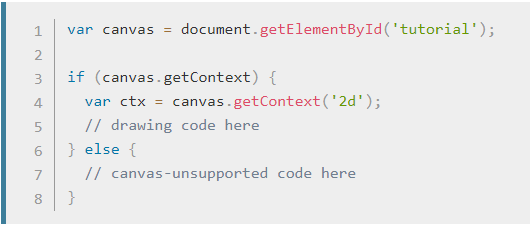

# Chart.js API

A great way to get started with charts is with Chart.js, a JavaScript plugin that uses HTML5’s canvas element to draw the graph onto the page. It’s a well documented plugin that makes using all kinds of bar charts, line charts, pie charts and more, incredibly easy.

To see how to use chart.js we’re going to create a set of 3 graphs; one will show the number of buyers a fictional product has over the course of 6 months, this will be a line chart; the second will show which countries the customers come from, this will be the pie chart; finally we’ll use a bar chart to show profit over the period.

## Setting up

The first thing we need to do is download Chart.js. Copy the Chart.min.js out of the unzipped folder and into the directory you’ll be working in. Then create a new html page and import the script:
              
              <!DOCTYPE html>
                  <html lang="en">
                        <head>
                                 <meta charset="utf-8" />
                                 <title>Chart.js demo</title>
                                 
                        </head>
                               <body>
                               </body>
                    </html>

Drawing a line chart
To draw a line chart, the first thing we need to do is create a canvas element in our HTML in which Chart.js can draw our chart. So add this to the body of our HTML page:
                    
              <canvas id="buyers" width="600" height="400"></canvas>

Next, we need to write a script that will retrieve the context of the canvas, so add this to the foot of your body element:

              
                
                
                
Inside the same script tags we need to create our data, in this instance it’s an object that contains labels for the base of our chart and datasets to describe the values on the chart. Add this immediately above the line that begins ‘var buyers=’:

                        var buyerData = {
	labels : ["January","February","March","April","May","June"],
	datasets : [
		{
			fillColor : "rgba(172,194,132,0.4)",
			strokeColor : "#ACC26D",
			pointColor : "#fff",
			pointStrokeColor : "#9DB86D",
			data : [203,156,99,251,305,247]
		}
    
    
If you test your file in a browser you’ll now see a cool animated line graph.

 # Conclusion
 You can view a demo of this in action here, and if you prefer copy and paste, here is the full script:
 
                              <!DOCTYPE html>
                                  <html lang="en">
    <head>
        <meta charset="utf-8" />
        <title>Chart.js demo</title>
        <!-- import plugin script -->
        
    </head>
    <body>
        <!-- line chart canvas element -->
        <canvas id="buyers" width="600" height="400"></canvas>
        <!-- pie chart canvas element -->
        <canvas id="countries" width="600" height="400"></canvas>
        <!-- bar chart canvas element -->
        <canvas id="income" width="600" height="400"></canvas>
        
    </body>
    </html>
    
The great things about Chart.js are that it’s simple to use and really very flexible. Plus, once you’ve mastered the basics here, you’ll discover that there are tons of options listed in the documentation.

fOr THE cHART.JS DOC see this [chart.js](http://www.chartjs.org/docs/)

# Basic usage of canvas

  ## The < canvas > element
  		
		<canvas id="tutorial" width="150" height="150"></canvas>
		
  At first sight a < canvas > looks like the < img > element, with the only clear difference being that it doesn't have the src and alt attributes. Indeed, the < canvas > element has only two attributes, width and height. These are both optional and can also be set using DOM properties. When no width and height attributes are specified, the canvas will initially be 300 pixels wide and 150 pixels high. The element can be sized arbitrarily by CSS, but during rendering the image is scaled to fit its layout size: if the CSS sizing doesn't respect the ratio of the initial canvas, it will appear distorted.
  
  
  ## The rendering context
  The <canvas> element creates a fixed-size drawing surface that exposes one or more rendering contexts, which are used to create and manipulate the content shown. In this tutorial, we focus on the 2D rendering context. Other contexts may provide different types of rendering; for example, WebGL uses a 3D context based on OpenGL ES.

The canvas is initially blank. To display something, a script first needs to access the rendering context and draw on it. The <canvas> element has a method called getContext(), used to obtain the rendering context and its drawing functions. getContext() takes one parameter, the type of context. For 2D graphics, such as those covered by this tutorial, you specify "2d" to get a CanvasRenderingContext2D.
	
	var canvas = document.getElementById('tutorial');
	var ctx = canvas.getContext('2d');
	
## Checking for support

## A skeleton template

Here is a minimalistic template, which we'll be using as a starting point for later examples.

	
	
	

