# Transforms
With CSS3 came new ways to position and alter elements. Now general layout techniques can be revisited with alternative ways to size, position, and change elements. All of these new techniques are made possible by the transform property.

The transform property comes in two different settings, **two-dimensional and three-dimensional**. Each of these come with their own individual properties and values.

# Transform Syntax
Two-dimensional transforms work on the x and y axes, known as horizontal and vertical axes. Three-dimensional transforms work on both the x and y axes, as well as the z axis. These three-dimensional transforms help define not only the length and width of an element, but also the depth.

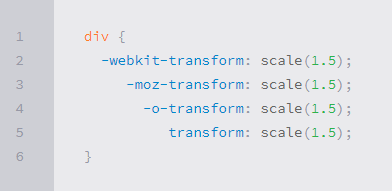

# 2D Transforms
he rotate value provides the ability to rotate an element from 0 to 360 degrees. Using a positive value will rotate an element clockwise, and using a negative value will rotate the element counterclockwise. The default point of rotation is the center of the element, 50% 50%, both horizontally and vertically

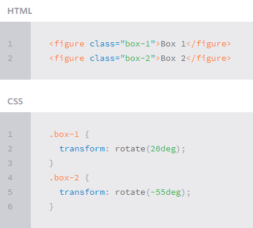

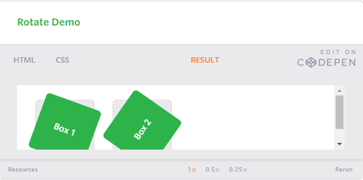

# 2D Scale

Using the scale value within the transform property allows you to change the appeared size of an element. The default scale value is 1, therefore any value between .99 and .01 makes an element appear smaller while any value greater than or equal to 1.01 makes an element appear larger.

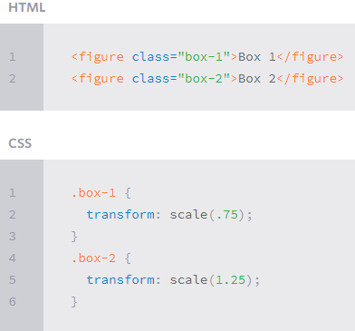

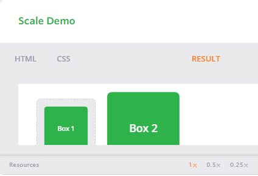

# 2D Translate
The translate value works a bit like that of relative positioning, pushing and pulling an element in different directions without interrupting the normal flow of the document. Using the translateX value will change the position of an element on the horizontal axis while using the translateY value will change the position of an element on the vertical axis

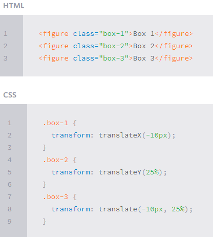

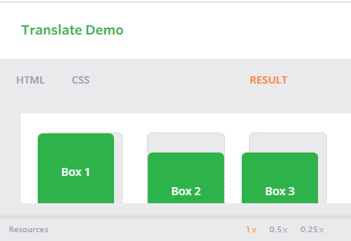

# 2D Skew

skew, is used to distort elements on the horizontal axis, vertical axis, or both.

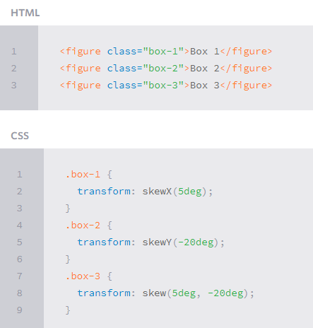

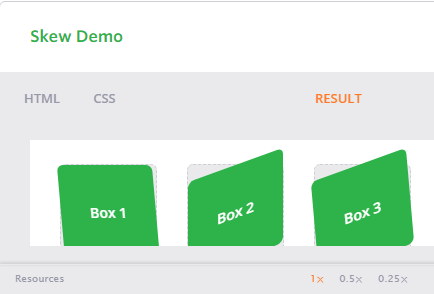

# Transform Origin
The default transform origin is the dead center of an element, both 50% horizontally and 50% vertically. To change this default origin position the transform-origin property may be used.

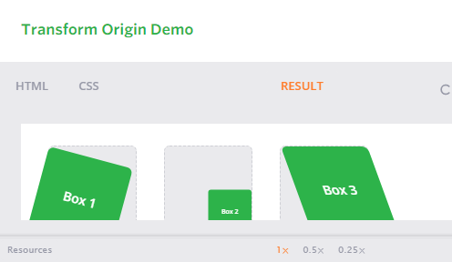

# 3D Transforms

# 3D Rotate
Using the rotateX value allows you to rotate an element around the x axis, as if it were being bent in half horizontally. Using the rotateY value allows you to rotate an element around the y axis, as if it were being bent in half vertically. Lastly, using the rotateZ value allows an element to be rotated around the z axis.

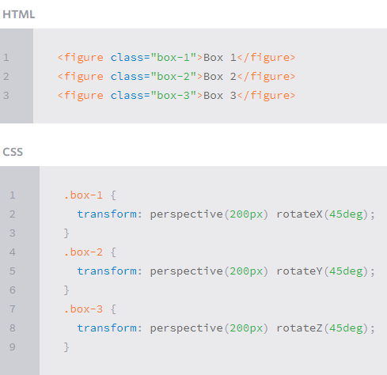

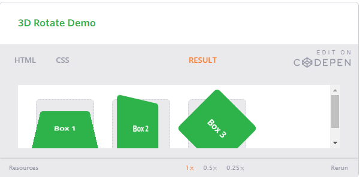

# 3D Scale

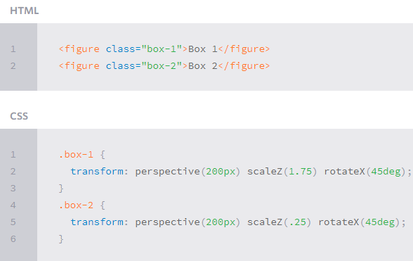

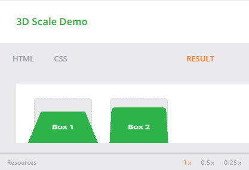

# 3D Translate

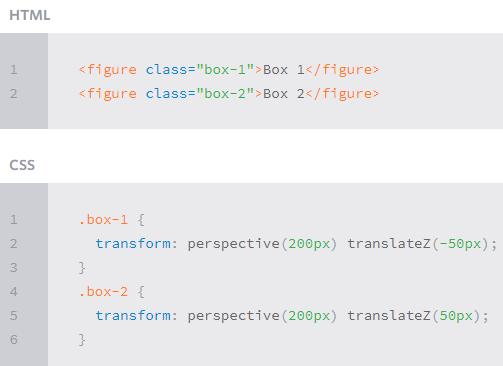

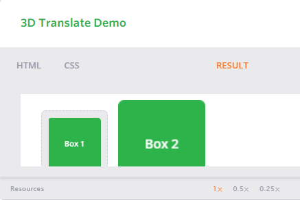

# Transitions 
 to take place, an element must have a change in state, and different styles must be identified for each state. The easiest way for determining styles for different states is by using the :hover, :focus, :active, and :target pseudo-classes.
 
 There are four transition related properties in total, including transition-property, transition-duration, transition-timing-function, and transition-delay. Not all of these are required to build a transition, with the first three are the most popular.
 
 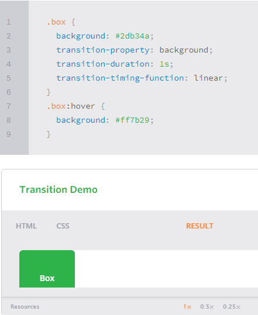
 
 
 **Transitional Properties**
 
 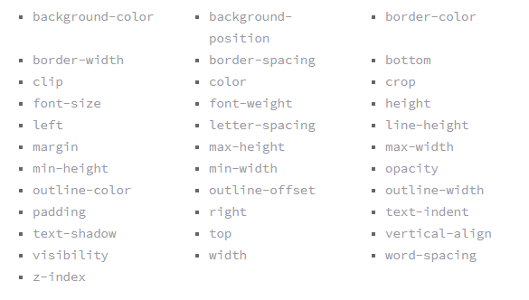
 
 # Transition Duration
 The duration in which a transition takes place is set using the transition-duration property. The value of this property can be set using general timing values, including seconds (s) and milliseconds (ms). These timing values may also come in fractional measurements, .2s for example.
 
 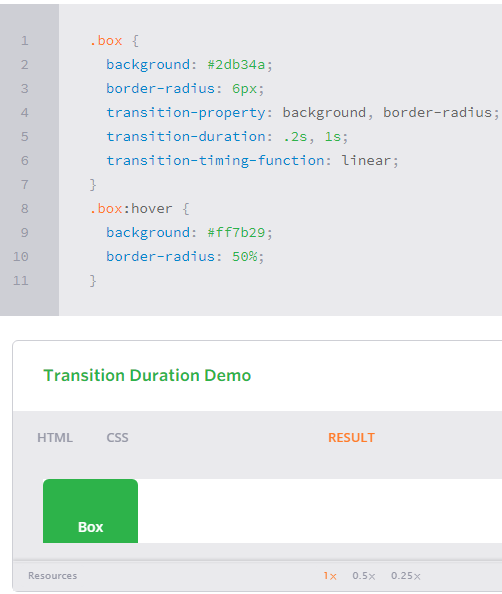
 
 # Transition Timing
 
  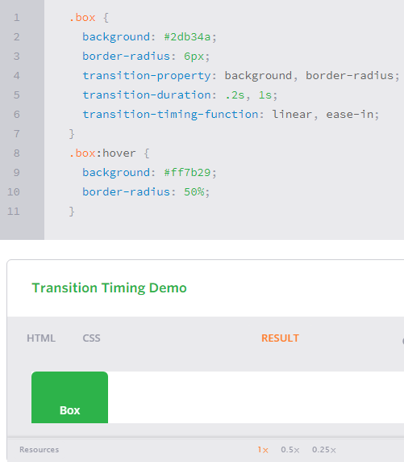
  

# Animations

when more control is required, transitions need to have multiple states. In return, this is where animations pick up where transitions leave off.

# Animations Keyframes

To set multiple points at which an element should undergo a transition, use the @keyframes rule. The @keyframes rule includes the animation name, any animation breakpoints, and the properties intended to be animated.

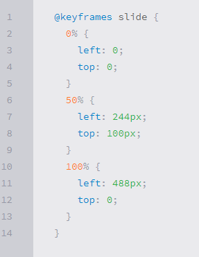

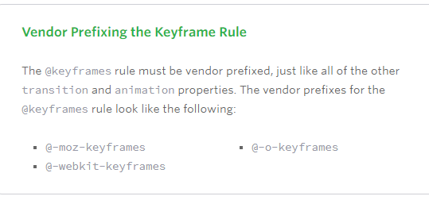

# Animation Name
Once the keyframes for an animation have been declared they need to be assigned to an element. To do so, the animation-name property is used with the animation name, identified from the @keyframes rule, as the property value.

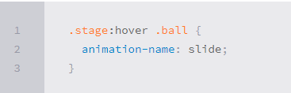

# Animation Duration, Timing Function, & Delay

To start, animations need a duration declared using the animation-duration property. As with transitions, the duration may be set in seconds or milliseconds.

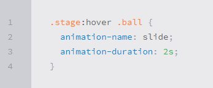

A timing function and delay can be declared using the animation-timing-function and animation-delay properties respectively. The values for these properties mimic and behave just as they do with transitions.

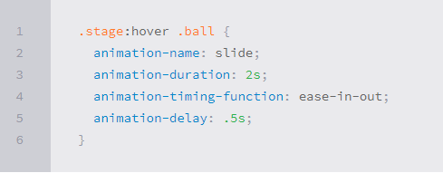

for custmize animation [see this](https://learn.shayhowe.com/advanced-html-css/transitions-animations/#customizing-animations)

