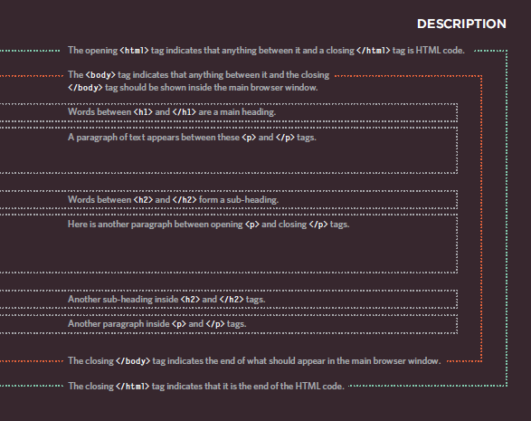
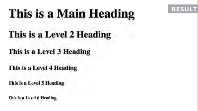
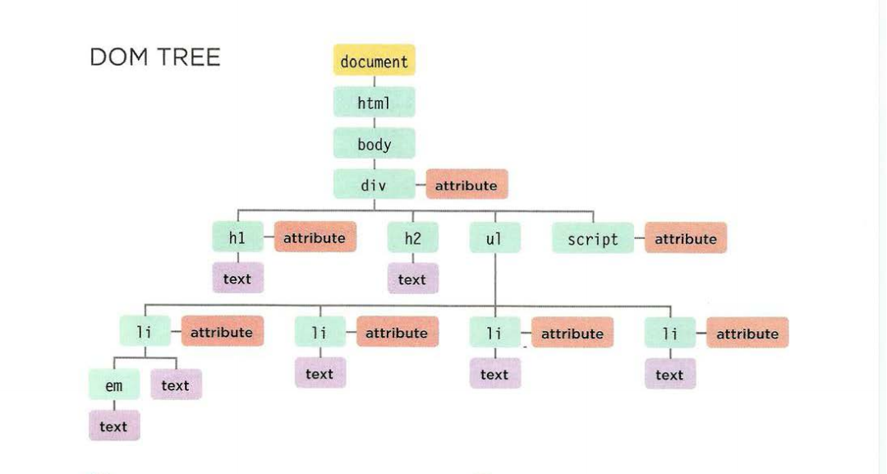
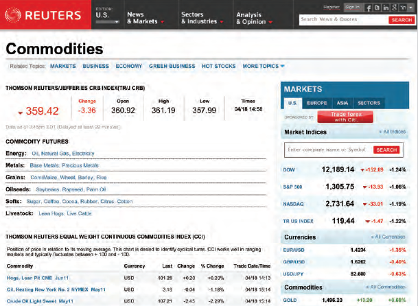
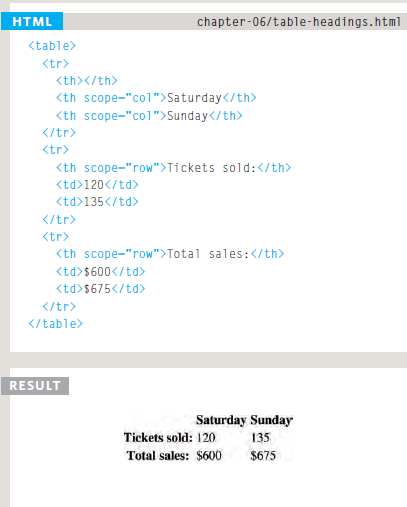
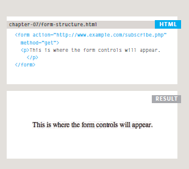
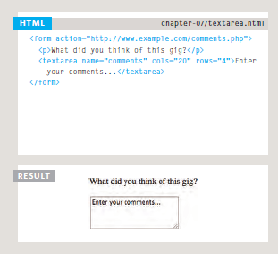
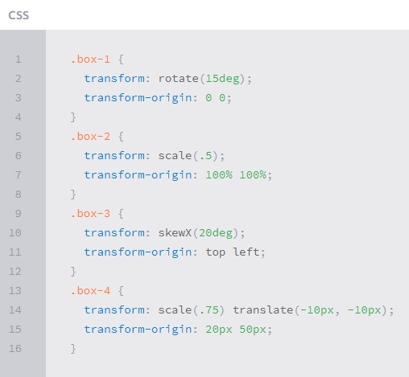

# Introductory HTML and JavaScript

# Structure
   The HTML code is made up of characters that live inside angled brackets — these are called HTML elements. Elements are usually made up of two tags: an opening tag and a closing tag. (The closing tag has an extra forward slash in it.) Each HTML element tells the browser something about the information that sits between its opening and closing tags. DOCTYPES tell browsers which version of HTML you are using.
   
   
    <html>
    <body>
    <h1>This is the Main Heading</h1>
    
This text might be an introduction to the rest of
    the page. And if the page is a long one it might
    be split up into several sub-headings.

    <h2>This is a Sub-Heading</h2>
    
Many long articles have sub-headings so to help
    you follow the structure of what is being written.
    There may even be sub-sub-headings (or lower-level
    headings).

    <h2>Another Sub-Heading</h2>
    
Here you can see another sub-heading.

    </body>
    </html>
    
        
   
   
      
#  Grouping Text & Elements In a Block
 # **< div > element**
 
   The ( < div > ) element allows you to group a set of elements together in one block-level box.
      
    

    
    <ul>
    <li><a href="index.html">Home</a></li>
    <li><a href="biography.html">Biography</a></li>
    <li><a href="works.html">Works</a></li>
    <li><a href="contact.html">Contact</a></li>
    </ul>
    
<!-- end of header -->
     
 # HTML5 Layout

   HTML5 introduces a new set of elements that allow you to divide up the parts of a page. The names of these elements indicate the kind of content you will find in them. The point of creating these new elements is so that web page authors can use them to help describe the structure of the page. 
   
   
   
   
  ## **Headers & Footers**
   
   The < header > and < footer > elements can be used for:
     ● The main header or footer that appears at the top or bottom of every page on the site.
     ● A header or footer for an individual <article> or <section> within the page.
  
   

  ## Navigation
  
   The < nav > element is used to contain the major navigational blocks on the site such as the primary site navigation.
  
   

  ## Articles
  
   The < article > element acts as a container for any section of a page that could stand alone and potentially be syndicated. This could be an individual article or blog entry,     a comment or forum post, or any other independent piece of content.
  
   
  
  
  
  ## Section 
  
   The < section > element groups related content together, and typically each section would have its own heading.
  
   
   
   
# **Text Introduction**

 ## How to add markup to the text 
   Thre istow type of markup :
   
   - **Structural markup**: the elements that you can use to describe both headings and paragraphs
   
   - **Semantic markup**: which provides extra information, such as where emphasis is placed in a sentence , that something you have written is a quotation, the meaning of                 acronyms, and so on.
   
   
 # **Structural markup**: 

  ## Headings 

   HTML has six "levels" of headings, the contents of an <h1> element is the largest, and the contents of an <h6> element is the smallest.
   
   
   head level    | tag
   ------------- | -------------  
   h1 | < h1 > This is a Main Heading < /h1 >
   h2 | < h2 > This is a Level 2 Heading < /h2 >
   h3 | < h3 > This is a Level 3 Heading < /h3 >
   h4 | < h4 > This is a Level 4 Heading < /h4 >
   h5 | < h5 > This is a Level 5 Heading < /h5 >
   h6 | < h6 > This is a Level 6 Heading < /h6 >

  
  
  
 # **Semantic markup**:

  ## Strong & Emphasis
 
  **< strong >** : The use of the < strong > element indicates that its content has strong importance.
 
  **< em >** : The < em > element indicates emphasis that subtly changes the meaning of a sentence. By default browsers will show the contents of an < em > element in italic.
 
 
  
  
  
# List

  HTML provides us with three different types:
  
  
  ## Ordered List
 
   Are lists where each item in the list is numbered. For example,a legal contract where each point needs to be identified by a section number.
  
  
   **< ol >**
   
   The ordered list is created with the < ol > element.
  
  
   **< li >**
   
   Each item in the list is placed between an opening < li > tag and a closing < /li > tag. **(The li stands for list item.)**

  # Example :
      
        <ol>
        <li>Chop potatoes into quarters</li>
         <li>Simmer in salted water for 15-20
        minutes until tender</li>
        <li>Heat milk, butter and nutmeg</li>
        <li>Drain potatoes and mash</li>
        <li>Mix in the milk mixture</li>
        </ol>
 
   
   
 ## **Unordered List**
 
   Are lists that begin with a bullet point (rather than characters that indicate order).

   **< ul >**
   
   The unordered list is created with the < ul > element.
  
  **< li >**
  
   Each item in the list is placed between an opening < li > tag and a closing < /li > tag. (The li stands for list item.)
     
  # Example :
  
         <ul>
         <li>1kg King Edward potatoes</li>
         <li>100ml milk</li>
         <li>50g salted butter</li>
         <li>Freshly grated nutmeg</li>
         <li>Salt and pepper to taste</li>
         </ul>
         
         
   
   
   
   
# Link

   Links are the defining feature of the web because they allow you to move from one web page to another.
   
   
   ## Writing Links
   
   Links are created using the < a > element. Users can click on anything between the opening < a > tag and the closing < /a > tag. You specify which page you want to link to       using the href attribute.
    
   
     
  The text between the opening < a > tag and closing < /a > tag is known as link text. Where possible, your link text should explain where visitors will be taken .To write good    link text, you can think of words people might use when searching for the page that you are linking to.
  
  
  

   ### Linking to Other Sites
   
   **< a >**  Links are created using the < a > element which has an attribute called href. The value of thehref attribute is the page that you want people to go to when they      click on the link. Users can click on anything that appears between the opening < a > tag and the closing < /a > tag and will be taken to the page specified in the href          attribute. When you link to a different website, the value of the href attribute will be the full web address for the site, which is known as an absolute URL.
   
            
Movie Reviews:
               <ul>
                     <li><a href="http://www.empireonline.com">
                              Empire</a></li>
                              
                     <li><a href="http://www.metacritic.com">
                              Metacritic</a></li>
                              
                     <li><a href="http://www.rottentomatoes.com">
                              Rotten Tomatoes</a></li>
                              
                     <li><a href="http://www.variety.com">
                              Variety</a></li>
                              
               </ul>
            

   
   
   
   

 ### Linking to Other Pages on the Sa me Site
   
   **< a >**  When you are linking to other pages within the same site, you do not need to specify the domain name in the URL. You can use a shorthand known as a relative URL.        If all the pages of the site are in the same folder, then the value of the href attribute is just the name of the file. If you have different pages of a site in different        folders, then you can use a slightly more complex syntax to indicate where the page is in relation to the current page.

            

                  <ul>
                     <li><a href="index.html">Home</a></li>
                     
                     <li><a href="about-us.html">About</a></li>
                     
                     <li><a href="movies.html">Movies</a></li>
                     
                     <li><a href="contact.html">Contact</a></li>
                     
                  </ul>
            

   
   
     
   
 
 ### Email Links
   
  ** mailto:**  To create a link that starts up the user's email program and addresses an email to a specified email address, you use the < a > element. However, this time the        value of the href attribute starts with mailto: and is followed by the email address you want the email to be sent to.

  
  
  
# Image

  ## How to add images to pages ?
  
   There are many reasons why you might want to add an image to a web page: you might want to include a logo, photograph, illustration, diagram, or chart.
   
   < img >  To add an image into the page you need to use an **< img > element**, which is an **empty element** (which means there is no closing tag).
   
  ### It must carry the following two attributes :
  
  
  
   - **src**
    This tells the browser where it can find the image file. This will usually be a relative URL pointing to an image on your own site.

   - **alt**
    This provides a text description of the image which describes the image if you cannot see it.
   
   - **Title** : 
    You can also use the title attribute with the < img > element to provide additional information about the image. 
    Most browsers will display the content of this attribute in a tootip when the user hovers over the image.

   You can also use CSS to include images in your pages using the **background-image** property.

         

# OBJECT

  ##  What is an Object?
   Objects group together a set of variables and functions to create a model  of a something you would recognize from the real world. In an object,  variables and functions take     on new names.

  ### Property
   IN AN OBJECT: VARIABLES BECOME KNOWN AS PROPERTIES  If a variable is part of an object, it is called a  property. Properties tell us about the object, such as  the name of a    hotel or the number of rooms it has.  Each individual hotel might have a different name  and a different number of rooms. 

  ### Method
   IN AN OBJECT: FUNCTIONS BECOME KNOWN AS METHODS  If a function is part of an object, it is called a method.  Methods represent tasks that are associated with  the object. For    example, you can check how many  rooms are available by subtracting the number of  booked rooms from the total number of rooms.
   
   

  ### Creating an object literal notation
   Literal is a way for creating an object.

   

  ### Accessing an object 
   Using **dot notation** we can access the object properties and methods.

   

# Document object model
   The Document Object Model (DOM) specifies how browsers should create a model of an HTML page and how JavaScript can access and update the 
   contents of a web page while it is in the browser window. 

   The DOM is neither part of HTML, nor part of JavaScript; it is a separate set of rules. It is implemented by all major browser makers,
    and covers two primary areas: 

   - MAKING A MODEL OF THE HTM L PAGE
   - ACCESSING AND CHANGING THE HTML PAGE

   ## Dom tree 
   As a browser loads a web page, it creates a model of that page. The model is called a DOM tree, and it is stored in the browsers' memory. 
   It consists of four main types of nodes. 

   - THE DOCUMENT NODE 
   - ELEMENT NODES
   - ATTRIBUTE NODES
   - TEXT NODES

   

# Tables 
  There are several types of information that need to be displayed in a grid or table. For example: sports results, stock reports, train timetables. When representing             information in a table, you need to think in terms of a grid made up of rows and columns (a bit like a spreadsheet).

  ## What's a Table?
   A table represents information in a grid format.Examples of tables include financial reports, TV schedules, and sports results.

   

  ## Basic Table Structure 

  - **< table >**
      The < table > element is used to create a table. The contents of the table are written out row by row.

  - **< tr >**
      You indicate the start of each row using the opening **< tr > tag**. (*The tr stands for table row.*) .
      It is followed by one or more **< td > elements** (*one for each cell in that row*). At the end of the row you use a closing < /tr > tag.

  - **< td >**
    Each cell of a table is represented using a < td > element. (The td stands for table data.)

    

   ### Table Headings

   - **< th >**
     The < th > element is used just like the < td > element but its purpose is to represent the heading for either a column or a row. (The th stands for table heading.)
     Even if a cell has no content, you should still use a < td > or < th > element to represent the presence of an empty cell otherwise the table will not render correctly. 

     

   ## Example

              <html>
                 <head>
                   <title>Tables</title>
                 </head>
                 
                 <body>
                      <table>
                          <thead>
                              <tr>
                                  <th></th>
                                      <th scope="col">Home starter hosting</th>
                                      <th scope="col">Premium business hosting</th>
                              </tr>
                          </thead>
                      <tbody>
                              <tr>
                                  <th scope="row">Disk space</th>
                                     <td>250mb</td>
                                     <td>1gb</td>
                              </tr>
                              <tr>
                                  <th scope="row">Bandwidth</th>
                                  <td>5gb per month</td>
                                  <td>50gb per month</td>
                              </tr>
                            <!-- more rows like the two above here -->
                      </tbody>
                      <tfoot>
                              <tr>
                                  <td></td>
                                  <td colspan="2">Sign up now and save 10%!</td>
                              </tr>
                      </tfoot>
                      </table>
                  </body>
               </html>

# Layout
   CSS treats each HTML element as if it is in its own box. This box will either be a **block-level box or an inline box**.
   **Block-level** boxes start on a new line and act as the main building blocks of any layout, while **inline boxes** flow between surrounding text. You can control how much      space each box takes up by setting the width of the boxes .To separate boxes, you can use **borders, margins, padding, and background colors**.
       
   
   
   
   ### Containing Elements
   
   If one block-level element sits inside another block-level element then the outer box is known as the **containing or parent element**.
   
   It is common to group a number of elements together inside a < div > (or other block-level) element. For example, you might group together all of the elements that form the      header of a site (such as the logo and the main navigation). The < div > element that contains this group of elements is then referred to as the containing element. 
   
   
   
   
# Form 

   ## Traditionally, the term 'form' has referred to a printed document that contains spaces for you to fill in information.
   Whether you are adding a simple search box to your website or you need to create more complicated insurance applications, HTML forms give you a set of elements to collect        data from your users.

   ### Why form ?
   The best known form on the web is probably the search box that sits right in the middle of Google's homepage.In addition to enabling users to search, forms also allow users      to perform other functions online. You will see forms when registering as a member of a website, when shopping online, and when signing up for newsletters or mailing lists.

   

   ### Forms controls 
   There are several types of form controls that you can use to collect information from visitors to your site.
   
   

   ### How Forms Work ?

   

   A form may have several form controls, each gathering different information. The server needs to know which piece of inputted data corresponds with which form element.

   ## Form Structure

   

   ### Text Input

   

   ### Password Input

   

   ### Text Area

   

   ### Radio Button

   

   ### Checkbox Button

   

   ### DropDown List Box

   

   ### Multiple Select Box

   

# Error Handling & Debugging
  JavaScript can be hard to learn and everyone makes mistakes when writing it.Error Handling & Debugging will help you learn
  how to find the errors in your code. It will also teach you how to write scripts that deal with potential errors gracefully.

  When you are writing JavaScript, do not expect to write it perfectly the first time. Programming is like problem solving: you are given a puzzle and not only do you have to     solve it, but you also need to create the instructions that allow the computer to solve it. too.

  When writing a long script, nobody gets everything right in their first attempt. The error messages that a browser gives look cryptic at first, but they can help you determine   what went wrong in your JavaScript and how to fix it.

   ## ORDER OF EXECUTION
   To find the source of an error, it helps to know how scripts are processed. The order in which statements are executed can be complex; some tasks cannot complete until          another statement or function has been run.

   

   1. The greeting variable gets its value from the **greetUser()** function.
   2. **greetUser()** creates the message by combining the string 'He 11 o ' with the result of getName ().
   3. **getName ()** returns the name to greetUser() .
   2. **greetUser()** now knows the name, and combines it with the string. It then returns the message to the statement that ca lled it in step 1.
   1. The value of the greeting is stored in memory.
   4. This greeting variable is written to an alert box.

   ## The Stack

   The JavaScript interpreter processes one line of code at a time. when a statement needs data from another function it stacks the new function on top of the current task.

   

# Chart.js API
  A great way to get started with charts is with Chart.js, a JavaScript plugin that uses HTML5’s canvas element to draw the graph onto the page. It’s a well documented plugin     that makes using all kinds of bar charts, line charts, pie charts and more, incredibly easy.

  To see how to use chart.js we’re going to create a set of 3 graphs; one will show the number of buyers a fictional product has over the course of 6 months, this will be a line   chart; the second will show which countries the customers come from, this will be the pie chart; finally we’ll use a bar chart to show profit over the period.

   ## Setting up
   The first thing we need to do is download Chart.js. Copy the Chart.min.js out of the unzipped folder and into the directory you’ll be working in. Then create a new html page    and import the script:
              
              <!DOCTYPE html>
                  <html lang="en">
                        <head>
                                 <meta charset="utf-8" />
                                 <title>Chart.js demo</title>
                                 
                        </head>
                               <body>
                               </body>
                    </html>

   Drawing a line chart
   To draw a line chart, the first thing we need to do is create a canvas element in our HTML in which Chart.js can draw our chart. So add this to the body of our HTML page:
                    
              <canvas id="buyers" width="600" height="400"></canvas>

   Next, we need to write a script that will retrieve the context of the canvas, so add this to the foot of your body element:

              
                
                
                
  Inside the same script tags we need to create our data, in this instance it’s an object that contains labels for the base of our chart and datasets to describe the values on     the chart. Add this immediately above the line that begins ‘var buyers=’:

                        var buyerData = {
	labels : ["January","February","March","April","May","June"],
	datasets : [
		{
			fillColor : "rgba(172,194,132,0.4)",
			strokeColor : "#ACC26D",
			pointColor : "#fff",
			pointStrokeColor : "#9DB86D",
			data : [203,156,99,251,305,247]
		}
    

   ## USING HTML5 STORAGE

   HTML5 Storage is based on named key/value pairs. You store data based on a named key, then you can retrieve that data with the same key. The named key is a string. The data      can be any type supported by JavaScript, including strings, Booleans, integers, or floats. However, the data is actually stored as a string. If you are storing and retrieving    anything other than strings, you will need to use functions like **parseInt() or parseFloat()** to coerce your retrieved data into the expected JavaScript datatype.

   

   Calling **setItem()** with a named key that already exists will silently overwrite the previous value. Calling getItem() with a non-existent key will return null rather than    throw an exception.

   Like other JavaScript objects, you can treat the localStorage object as an associative array. Instead of using the getItem() and setItem() methods, you can simply use square    brackets.

   #### For example, this snippet of code:

   

   There are also methods for removing the value for a given named key, and clearing the entire storage area (that is, deleting all the keys and values at once).

   

   Finally, there is a property to get the total number of values in the storage area, and to iterate through all of the keys by index (to get the name of each key).

   
           
  
  
 # What Google Learned From Its Quest to Build the Perfect Team
 
 Our data-saturated age enables us to examine our work habits and office quirks with a scrutiny that our cubicle-bound forebears could only dream of. Today, on corporate campuses and within university laboratories, psychologists, sociologists and statisticians are devoting themselves to studying everything from team composition to email patterns in order to figure out how to make employees into faster, better and more productive versions of themselves. ‘‘We’re living through a golden age of understanding personal productivity,’’ says Marshall Van Alstyne, a professor at Boston University who studies how people share information. ‘‘All of a sudden, we can pick apart the small choices that all of us make, decisions most of us don’t even notice, and figure out why some people are so much more effective than everyone else.’’
 
 # THE WORK ISSUE: REIMAGINING THE OFFICE
   01. How to Build a Perfect Team
   02. The War on Meetings
   03. The Case for Blind Hiring
   04. Failure to Lunch
   05. The 'Good Jobs' Gamble
   06. Rethinking the Work-Life Equation
   07. The Rise of White-Collar Automation
   08. The Post-Cubicle Office
   09. The New Dream Jobs
   
   Yet many of today’s most valuable firms have come to realize that analyzing and improving individual workers ­— a practice known as ‘‘employee performance optimization’’ — isn’t enough. As commerce becomes increasingly global and complex, the bulk of modern work is more and more team-based. One study, published in The Harvard Business Review last month, found that ‘‘the time spent by managers and employees in collaborative activities has ballooned by 50 percent or more’’ over the last two decades and that, at many companies, more than three-quarters of an employee’s day is spent communicating with colleagues.
   
   Five years ago, Google — one of the most public proselytizers of how studying workers can transform productivity — became focused on building the perfect team. In the last decade, the tech giant has spent untold millions of dollars measuring nearly every aspect of its employees’ lives. Google’s People Operations department has scrutinized everything from how frequently particular people eat together (the most productive employees tend to build larger networks by rotating dining companions) to which traits the best managers share (unsurprisingly, good communication and avoiding micromanaging is critical; more shocking, this was news to many Google managers).
   
   
   
# Project Aristotle’s researchers 
Project Aristotle’s researchers began searching through the data they had collected, looking for norms. They looked for instances when team members described a particular behavior as an ‘‘unwritten rule’’ or when they explained certain things as part of the ‘‘team’s culture.’’ Some groups said that teammates interrupted one another constantly and that team leaders reinforced that behavior by interrupting others themselves. On other teams, leaders enforced conversational order, and when someone cut off a teammate, group members would politely ask everyone to wait his or her turn. Some teams celebrated birthdays and began each meeting with informal chitchat about weekend plans. Other groups got right to business and discouraged gossip. There were teams that contained outsize personalities who hewed to their group’s sedate norms, and others in which introverts came out of their shells as soon as meetings began.

Project Aristotle researchers concluded that understanding and influencing group norms were the keys to improving Google’s teams. Google’s research had identified dozens of behaviors that seemed important, except that sometimes the norms of one effective team contrasted sharply with those of another equally successful group. Was it better to let everyone speak as much as they wanted, or should strong leaders end meandering debates? Was it more effective for people to openly disagree with one another, or should conflicts be played down? The data didn’t offer clear verdicts.

